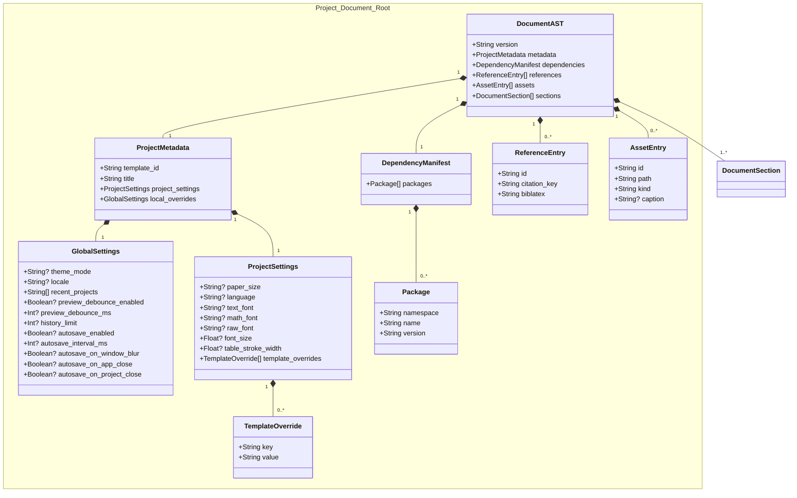
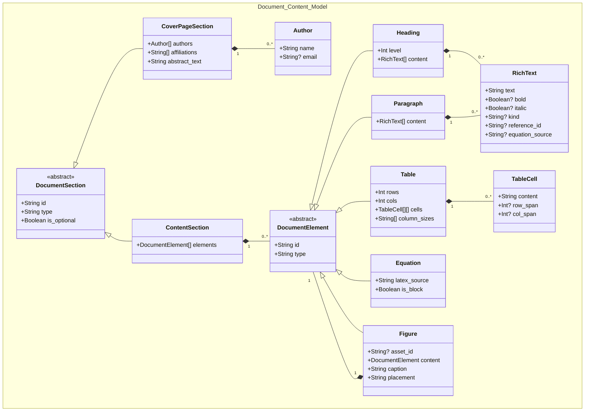
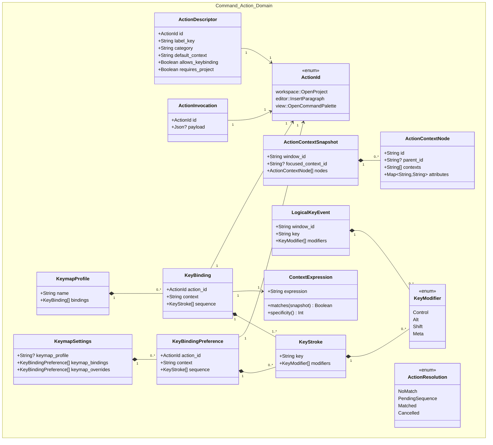
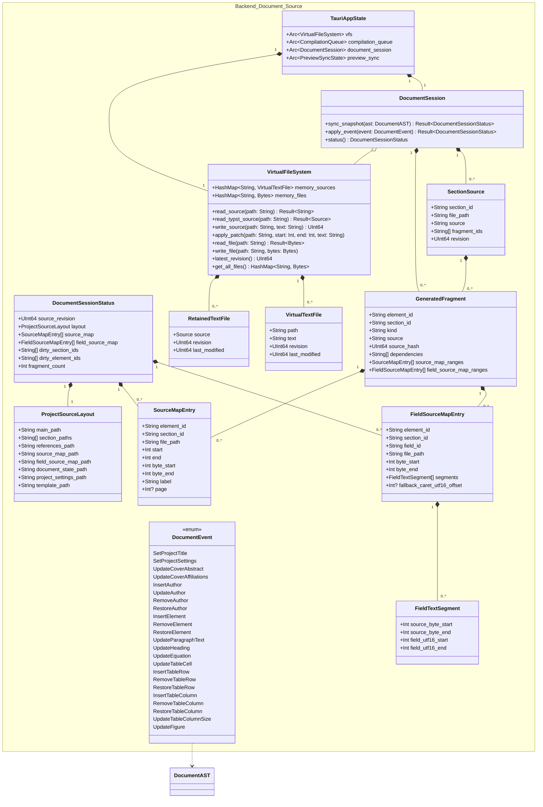
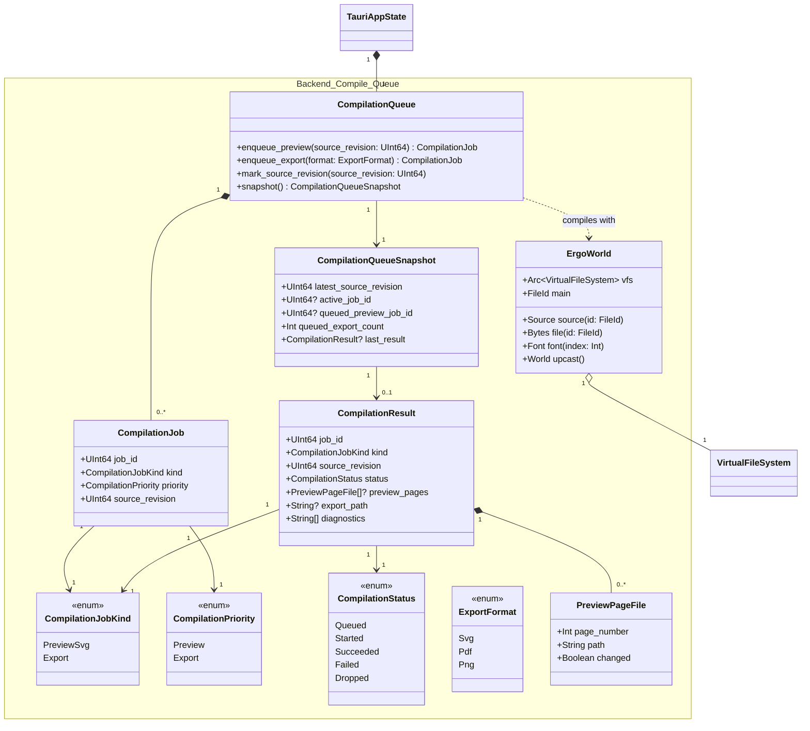
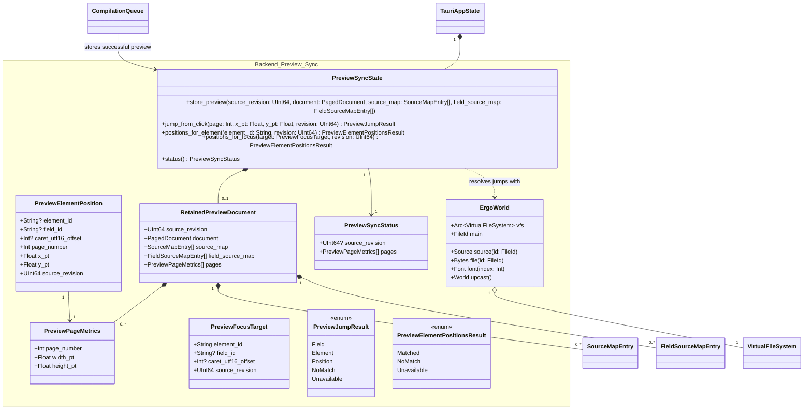
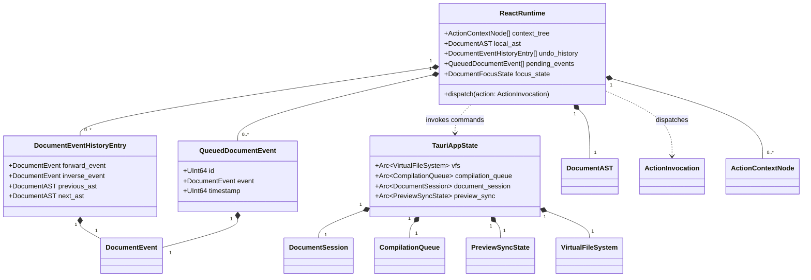

# Class Diagrams

This document describes the core domain models and backend structs that define Érgo's architecture. Rust structs that cross the Tauri IPC boundary must be exported to TypeScript with `ts-rs`.

The diagrams are split by responsibility so each view answers one question without requiring the full system to fit in a single graph.

## Project Metadata, Settings, And Resources

## Document Sections And Elements

## Action And Keymap Domain

## Document Session, Source Maps, And VFS

## Compilation Queue

## Preview Sync

## Cross-Domain Ownership

## Model Notes

- Frontend document elements do not generate Typst source directly as the canonical path. Rust `DocumentSession` owns canonical source materialization.
- `main.typ` is generated as a small entry point. Each enabled document section is generated as `sections/{section-id}.typ`.
- `GeneratedFragment` is an internal cache record for one element or section-level fragment. It supports dirty detection and source-map generation but is not persisted as a separate file in v1.
- `FieldSourceMapEntry` maps generated Typst byte ranges back to editor field IDs. Plain text segments track UTF-16 offsets because browser text selection APIs use UTF-16 code units.
- `RetainedTextFile.source` represents a retained Typst `Source`. The public `VirtualTextFile` status type exposes text and revision metadata, not the internal Typst source object. Generated preview SVGs are stored as VFS file bytes, not retained text sources.
- VFS edits should update retained sources with `Source::replace` or `Source::edit` to benefit from Typst incremental parsing.
- `CompilationResult.preview_pages` is the preview contract. Each preview page reports whether its SVG file changed.
- `PreviewSyncState` keeps only runtime sync data. It is not persisted inside `.ergproj` archives.
- The retained preview keeps the compiled `PagedDocument`, element source-map snapshot, field source-map snapshot, Typst source snapshot, source revision, and page metrics together.
- Preview sync returns `Unavailable` when the requested revision is not the retained preview revision.
- `SourceMapEntry` byte ranges use half-open ownership: `byte_start` is included and `byte_end` is excluded. Adjacent generated fragments must not both claim the same boundary byte.
- Backward sync maps `typst_ide::Jump::File` offsets to field ranges first and element ranges second. Forward sync maps `PreviewFocusTarget` values to Typst preview positions with `jump_from_cursor`.
- Keymap preference files use typed `action_id` values such as `workspace::OpenProject`, a context expression such as `editor && !input`, and a logical-key `sequence` array. The persisted keymap schema is strict.
- React owns `ActionContextNode` registration and action handlers. Rust owns `ActionDescriptor`, keymap validation, context-expression matching, sequence state, and `ActionResolution`.
- Public IPC DTOs that cross the Tauri boundary are exported with `ts-rs` into `src/bindings/`; frontend code must import those generated types directly. Local Rust `u64` counters and revisions are exported as TypeScript `number` values under the assumption that session-local monotonic counters remain far below `Number.MAX_SAFE_INTEGER`.
- Backend coupling boundaries are module-level. The package diagram is the canonical place for source-module ownership and dependency rules.
