# Class Diagram

This document describes the core domain models and backend structs that define Érgo's architecture. Rust structs that cross the Tauri IPC boundary must be exported to TypeScript with `ts-rs`.

## Class Diagram

```mermaid
classDiagram
    namespace Document_AST_Domain {
        class DocumentAST {
            +String version
            +ProjectMetadata metadata
            +DependencyManifest dependencies
            +ReferenceEntry[] references
            +AssetEntry[] assets
            +DocumentSection[] sections
        }

        class ProjectMetadata {
            +String template_id
            +String title
            +ProjectSettings project_settings
            +GlobalSettings local_overrides
        }

        class GlobalSettings {
            +String? theme_mode
            +String? locale
            +String[] recent_projects
            +Boolean? preview_debounce_enabled
            +Int? preview_debounce_ms
            +Int? history_limit
        }

        class ProjectSettings {
            +String? paper_size
            +String? language
            +String? text_font
            +String? math_font
            +String? raw_font
            +Float? font_size
            +Float? table_stroke_width
            +TemplateOverride[] template_overrides
        }

        class DependencyManifest {
            +Package[] packages
        }

        class ReferenceEntry {
            +String id
            +String citation_key
            +String biblatex
        }

        class AssetEntry {
            +String id
            +String path
            +String kind
            +String? caption
        }

        class DocumentSection {
            <<abstract>>
            +String id
            +String type
            +Boolean is_optional
        }

        class ContentSection {
            +DocumentElement[] elements
        }

        class CoverPageSection {
            +Author[] authors
            +String[] affiliations
            +String abstract_text
        }

        class DocumentElement {
            <<abstract>>
            +String id
            +String type
        }

        class Heading {
            +Int level
            +RichText[] content
        }

        class Paragraph {
            +RichText[] content
        }

        class Table {
            +Int rows
            +Int cols
            +TableCell[][] cells
            +String[] column_sizes
        }

        class Equation {
            +String latex_source
            +Boolean is_block
        }

        class Figure {
            +String? asset_id
            +DocumentElement content
            +String caption
            +String placement
        }
    }

    DocumentAST "1" *-- "1" ProjectMetadata
    DocumentAST "1" *-- "1" DependencyManifest
    DocumentAST "1" *-- "0..*" ReferenceEntry
    DocumentAST "1" *-- "0..*" AssetEntry
    DocumentAST "1" *-- "1..*" DocumentSection

    namespace Command_Action_Domain {
        class ActionId {
            <<enum>>
            workspace::OpenProject
            editor::InsertParagraph
            view::OpenCommandPalette
        }

        class ActionDescriptor {
            +ActionId id
            +String label_key
            +String category
            +String default_context
            +Boolean allows_keybinding
            +Boolean requires_project
        }

        class ActionInvocation {
            +ActionId id
            +Json? payload
        }

        class ActionContextSnapshot {
            +String window_id
            +String? focused_context_id
            +ActionContextNode[] nodes
        }

        class ActionContextNode {
            +String id
            +String? parent_id
            +String[] contexts
            +Map~String,String~ attributes
        }

        class ContextExpression {
            +String expression
            +matches(snapshot) Boolean
            +specificity() Int
        }

        class LogicalKeyEvent {
            +String window_id
            +String key
            +KeyModifier[] modifiers
        }

        class KeyStroke {
            +String key
            +KeyModifier[] modifiers
        }

        class KeyModifier {
            <<enum>>
            Control
            Alt
            Shift
            Meta
        }

        class KeyBinding {
            +ActionId action_id
            +String context
            +KeyStroke[] sequence
        }

        class KeyBindingPreference {
            +ActionId action_id
            +String context
            +KeyStroke[] sequence
        }

        class KeymapProfile {
            +String name
            +KeyBinding[] bindings
        }

        class KeymapSettings {
            +String? keymap_profile
            +KeyBindingPreference[] keymap_bindings
            +KeyBindingPreference[] keymap_overrides
        }

        class ActionResolution {
            <<enum>>
            NoMatch
            PendingSequence
            Matched
            Cancelled
        }
    }

    KeymapSettings "1" *-- "0..*" KeyBindingPreference
    KeymapProfile "1" *-- "0..*" KeyBinding
    KeyBinding "1" --> "1" ActionId
    KeyBinding "1" *-- "1..*" KeyStroke
    KeyBinding "1" --> "1" ContextExpression
    ActionDescriptor "1" --> "1" ActionId
    ActionInvocation "1" --> "1" ActionId
    ActionContextSnapshot "1" *-- "0..*" ActionContextNode
    DocumentSection <|-- ContentSection
    DocumentSection <|-- CoverPageSection
    ContentSection "1" *-- "0..*" DocumentElement
    DocumentElement <|-- Heading
    DocumentElement <|-- Paragraph
    DocumentElement <|-- Table
    DocumentElement <|-- Equation
    DocumentElement <|-- Figure

    namespace Backend_Core {
        class TauriAppState {
            +Arc~VirtualFileSystem~ vfs
            +Arc~CompilationQueue~ compilation_queue
            +Arc~DocumentSession~ document_session
            +Arc~PreviewSyncState~ preview_sync
        }

        class DocumentSession {
            +sync_snapshot(ast: DocumentAST) Result~DocumentSessionStatus~
            +status() DocumentSessionStatus
        }

        class GeneratedFragment {
            +String element_id
            +String section_id
            +String kind
            +String source
            +UInt64 source_hash
            +String[] dependencies
            +SourceMapEntry[] source_map_ranges
        }

        class SectionSource {
            +String section_id
            +String file_path
            +String source
            +String[] fragment_ids
            +UInt64 revision
        }

        class SourceMapEntry {
            +String element_id
            +String section_id
            +String file_path
            +Int start
            +Int end
            +Int byte_start
            +Int byte_end
            +String label
            +Int? page
        }

        class ProjectSourceLayout {
            +String main_path
            +String[] section_paths
            +String references_path
            +String source_map_path
            +String document_state_path
            +String project_settings_path
            +String template_path
        }

        class VirtualFileSystem {
            +HashMap~String, VirtualTextFile~ memory_sources
            +HashMap~String, Bytes~ memory_files
            +read_source(path: String) Result~String~
            +read_typst_source(path: String) Result~Source~
            +write_source(path: String, text: String) UInt64
            +apply_patch(path: String, start: Int, end: Int, text: String)
            +read_file(path: String) Result~Bytes~
            +write_file(path: String, bytes: Bytes)
            +latest_revision() UInt64
            +get_all_files() HashMap~String, Bytes~
        }

        class VirtualTextFile {
            +String path
            +String text
            +UInt64 revision
            +UInt64 last_modified
        }

        class RetainedTextFile {
            +Source source
            +UInt64 revision
            +UInt64 last_modified
        }

        class CompilationQueue {
            +enqueue_preview(source_revision: UInt64) CompilationJob
            +enqueue_export(format: ExportFormat) CompilationJob
            +mark_source_revision(source_revision: UInt64)
            +snapshot() CompilationQueueSnapshot
        }

        class CompilationJob {
            +UInt64 job_id
            +CompilationJobKind kind
            +CompilationPriority priority
            +UInt64 source_revision
        }

        class CompilationResult {
            +UInt64 job_id
            +CompilationJobKind kind
            +UInt64 source_revision
            +CompilationStatus status
            +String[]? svgs
            +PreviewPageFile[]? preview_pages
            +String? export_path
            +String[] diagnostics
        }

        class PreviewPageFile {
            +Int page_number
            +String path
            +Boolean changed
        }

        class PreviewSyncState {
            +store_preview(source_revision: UInt64, document: PagedDocument, source_map: SourceMapEntry[])
            +jump_from_click(page: Int, x_pt: Float, y_pt: Float, revision: UInt64) PreviewJumpResult
            +positions_for_element(element_id: String, revision: UInt64) PreviewElementPositionsResult
            +status() PreviewSyncStatus
        }

        class RetainedPreviewDocument {
            +UInt64 source_revision
            +PagedDocument document
            +SourceMapEntry[] source_map
            +PreviewPageMetrics[] pages
        }

        class PreviewPageMetrics {
            +Int page_number
            +Float width_pt
            +Float height_pt
        }

        class PreviewElementPosition {
            +String? element_id
            +Int page_number
            +Float x_pt
            +Float y_pt
            +UInt64 source_revision
        }

        class PreviewJumpResult {
            <<enum>>
            Element
            Position
            NoMatch
            Unavailable
        }

        class PreviewElementPositionsResult {
            <<enum>>
            Matched
            NoMatch
            Unavailable
        }

        class ErgoWorld {
            +Arc~VirtualFileSystem~ vfs
            +FileId main
            +Source source(id: FileId)
            +Bytes file(id: FileId)
            +Font font(index: Int)
            +World upcast()
        }
    }

    TauriAppState "1" *-- "1" VirtualFileSystem
    TauriAppState "1" *-- "1" CompilationQueue
    TauriAppState "1" *-- "1" DocumentSession
    TauriAppState "1" *-- "1" PreviewSyncState
    DocumentSession "1" o-- "1" VirtualFileSystem
    DocumentSession "1" *-- "0..*" GeneratedFragment
    DocumentSession "1" *-- "0..*" SectionSource
    SectionSource "1" *-- "0..*" GeneratedFragment
    VirtualFileSystem "1" *-- "0..*" RetainedTextFile
    CompilationQueue ..> ErgoWorld : compiles with
    CompilationQueue --> PreviewSyncState : stores successful preview
    PreviewSyncState "1" *-- "0..1" RetainedPreviewDocument
    RetainedPreviewDocument "1" *-- "0..*" PreviewPageMetrics
    RetainedPreviewDocument "1" *-- "0..*" SourceMapEntry
    PreviewSyncState ..> ErgoWorld : resolves jumps with
    ErgoWorld "1" o-- "1" VirtualFileSystem
    CompilationResult "1" *-- "0..*" PreviewPageFile
```

## Model Notes

- Frontend document elements do not generate Typst source directly as the canonical path. Rust `DocumentSession` owns canonical source materialization.
- `main.typ` is generated as a small entry point. Each enabled document section is generated as `sections/{section-id}.typ`.
- `GeneratedFragment` is an internal cache record for one element or section-level fragment. It supports dirty detection and source-map generation but is not persisted as a separate file in v1.
- `RetainedTextFile.source` represents a retained Typst `Source`. The public `VirtualTextFile` status type exposes text and revision metadata, not the internal Typst source object.
- VFS edits should update retained sources with `Source::replace` or `Source::edit` to benefit from Typst incremental parsing.
- `CompilationResult.preview_pages` is the preferred preview contract. Each preview page reports whether its SVG file changed. `svgs` exists for compatibility and export payloads.
- `PreviewSyncState` keeps only runtime sync data. It is not persisted inside `.ergproj` archives.
- The retained preview keeps the compiled `PagedDocument`, source-map snapshot, Typst source snapshot, source revision, and page metrics together.
- Preview sync returns `Unavailable` when the requested revision is not the retained preview revision.
- `SourceMapEntry` byte ranges use half-open ownership: `byte_start` is included and `byte_end` is excluded. Adjacent generated fragments must not both claim the same boundary byte.
- Backward sync maps `typst_ide::Jump::File` offsets to `SourceMapEntry` ranges. Forward sync maps an Érgo element ID to Typst preview positions with `jump_from_cursor`.
- Keymap preference files use typed `action_id` values such as `workspace::OpenProject`, a context expression such as `editor && !input`, and a logical-key `sequence` array. Older `command_id`, `keys`, and `scope` entries may be read only for migration.
- React owns `ActionContextNode` registration and action handlers. Rust owns `ActionDescriptor`, keymap validation, context-expression matching, sequence state, and `ActionResolution`.
