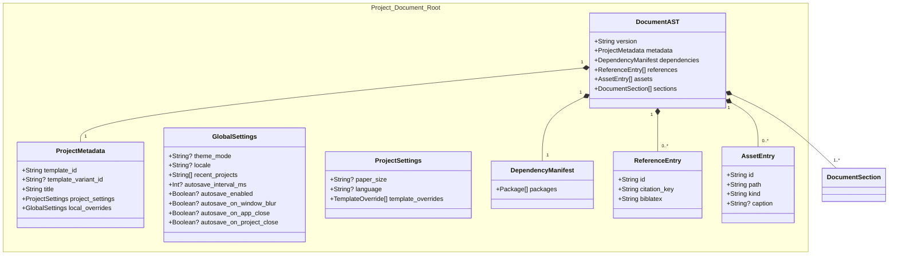
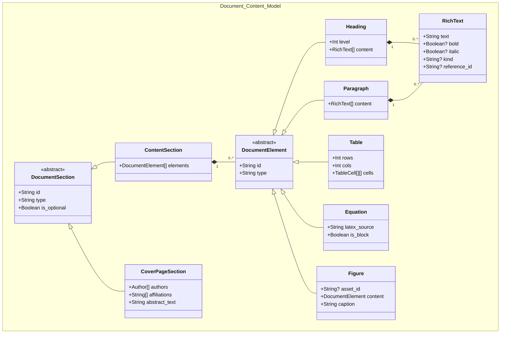
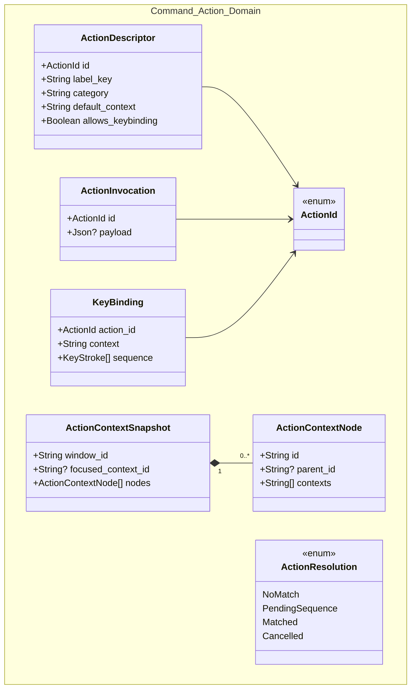
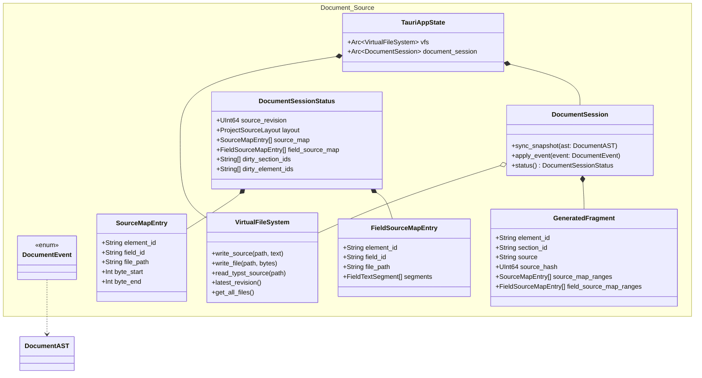
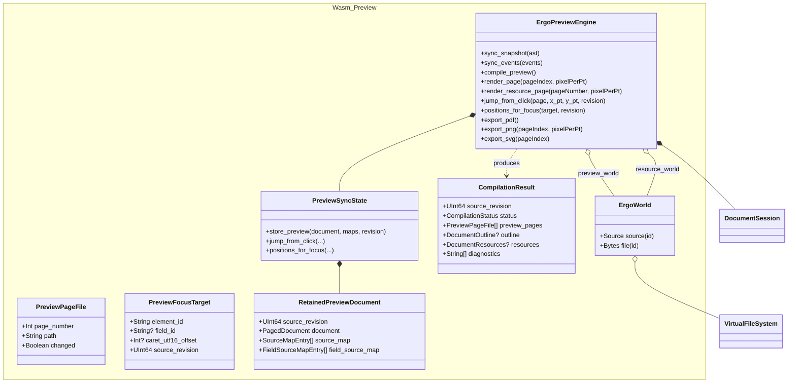

# Class Diagrams

Domain models, backend structs, and IPC DTO shapes. Types that cross Tauri IPC are exported with `ts-rs` into `src/bindings/`. See `README.md` for the section index.

## Project Metadata, Settings, And Resources

## Document Sections And Elements

## Action And Keymap Domain

## Document Session And VFS

## WASM Preview Engine

## Model Notes

- Frontend `DocumentContext` holds `local_ast`, queued `DocumentEvent`s, undo entries `{ forward_event, inverse_event }`, `DocumentFocusState`, and the action context tree; it applies the same event shape for live edits, undo, redo, worker sync, and backend mirror sync.
- `DocumentEvent` variants are defined in `document_session_types` and exported to TypeScript; the diagram omits the full enum list.
- `GeneratedFragment` is an in-memory cache entry, not a persisted archive file.
- `FieldSourceMapEntry` maps Typst byte ranges to editor field IDs with UTF-16 segments for browser selection APIs.
- `PreviewPageFile.path` is a logical page id (`page-N`) for Canvas rendering, not a VFS SVG artifact in the preview path.
- `PreviewSyncState` is runtime-only WASM state tied to the last successful non-stale compile.
- `SourceMapEntry` byte ranges are half-open: `byte_start` inclusive, `byte_end` exclusive.
- Module ownership and dependency direction are documented in `package-diagrams.md`.
