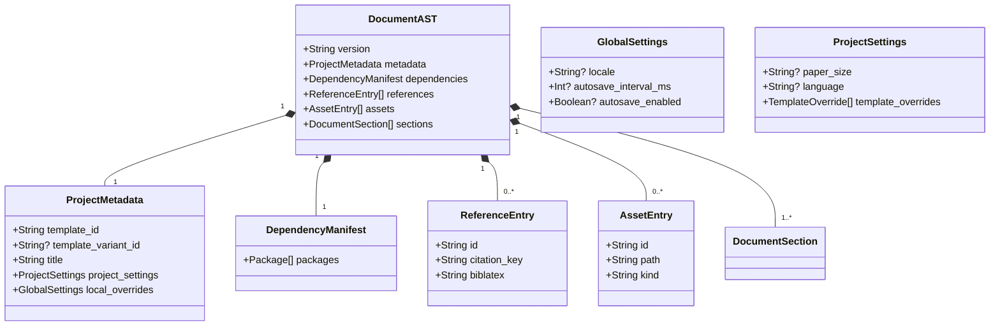
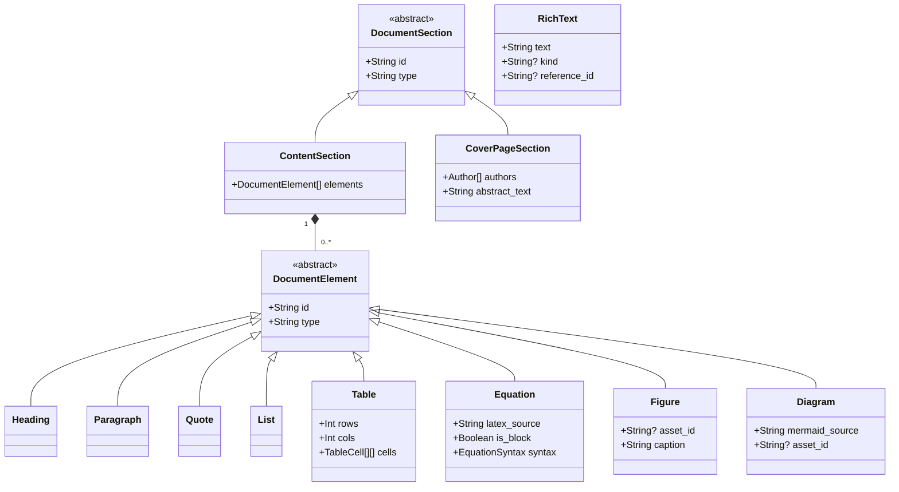
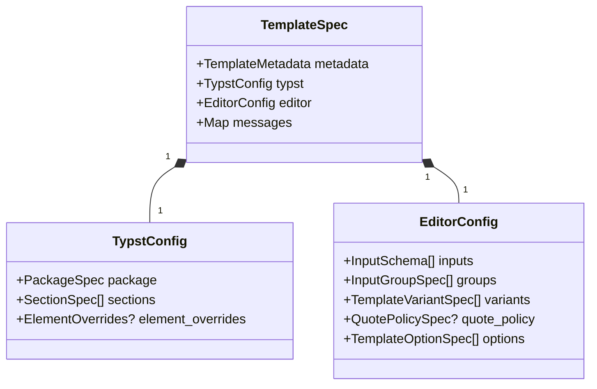
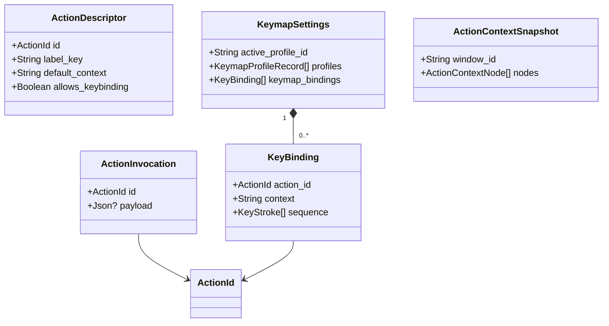
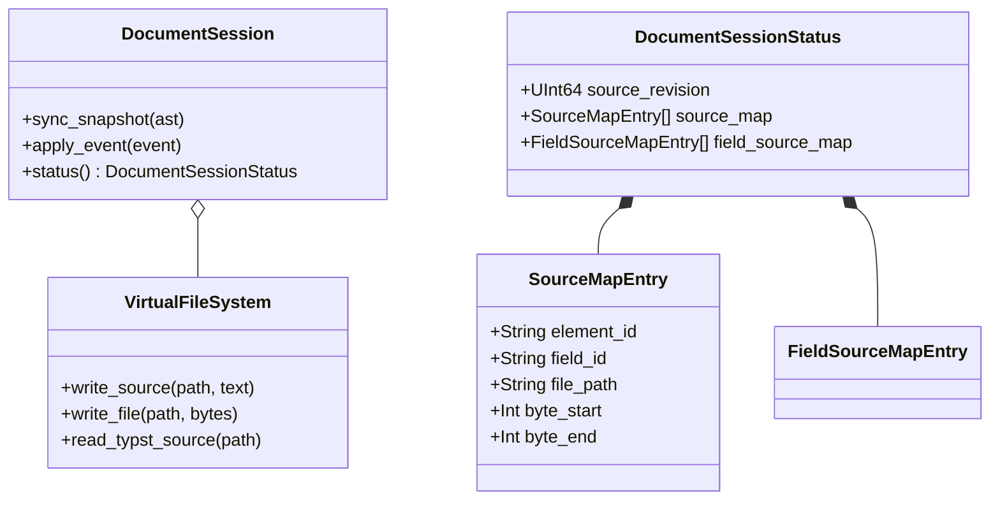
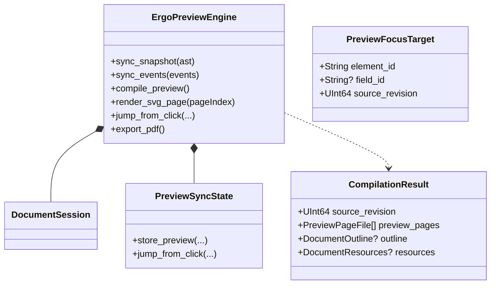

# Class Diagrams

Domain models, backend structs, and IPC DTO shapes. Types that cross Tauri IPC are exported with `ts-rs` into `src/bindings/`. See `README.md` for the section index.

## Project Metadata, Settings, And Resources

## Document Sections And Elements

## Template Specification

Bundled and custom templates ship a `template.json` manifest deserialized as `TemplateSpec`. The frontend loads it through `get_template_spec`; the backend uses it for Typst section assembly, element overrides, and editor input schemas.

## Action And Keymap Domain

## Document Session And VFS

## WASM Preview Engine

## Model Notes

- Frontend `DocumentContext` holds `local_ast`, queued `DocumentEvent`s, undo entries `{ forward_event, inverse_event }`, `DocumentFocusState`, and the action context tree. All committed AST mutations apply `DocumentEvent`s via `applyDocumentEvents` (body commits events directly; `dispatch(ASTAction)` derives events then commits the same `COMMIT_EVENTS` path). Undo, redo, worker sync, and backend mirror use the same event shape.
- `DocumentEvent` variants are defined in `document_session_types` and exported to TypeScript; class diagrams omit the full enum list.
- `RichText.kind` distinguishes inline embeds: `"reference"` (uses `reference_id`) and `"inlineEquation"` (uses `equation_source` and `equation_syntax`). Plain prose uses `kind: null`.
- `Figure`, `Diagram`, and `Table` elements emit inside a float wrapper Typst call. `ElementOverrides` may name a template-package wrapper function. Front-matter `#outline()` / `#pagebreak()` blocks are generated from `ProjectSettings.template_overrides`. `Diagram` stores Mermaid source and references a generated SVG under `assets/diagrams/{diagram-id}.svg`.
- Project settings store template option values in `ProjectSettings.template_overrides` under keys `option.{id}`. `QuotePolicySpec` is serialized as a word threshold or `"block"` / `"inline"`; paragraph split/reconcile helpers exist in `quotePolicy.ts` but are not connected to the live editor.
- `GeneratedFragment` is an in-memory cache entry, not a persisted archive file.
- `FieldSourceMapEntry` maps Typst byte ranges to editor field IDs with UTF-16 segments for browser selection APIs.
- `PreviewPageFile.path` is a logical page id (`page-N`) for preview rendering, not a VFS SVG artifact.
- `PreviewSyncState` is runtime-only WASM state tied to the last successful non-stale compile.
- `SourceMapEntry` byte ranges are half-open: `byte_start` inclusive, `byte_end` exclusive.
- Module ownership and dependency direction: `package-diagrams.md`. Preview and sync flows: `sequence-diagrams.md` §1 and §7.
