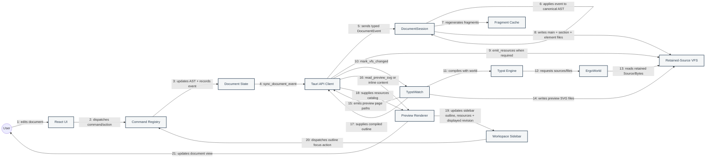
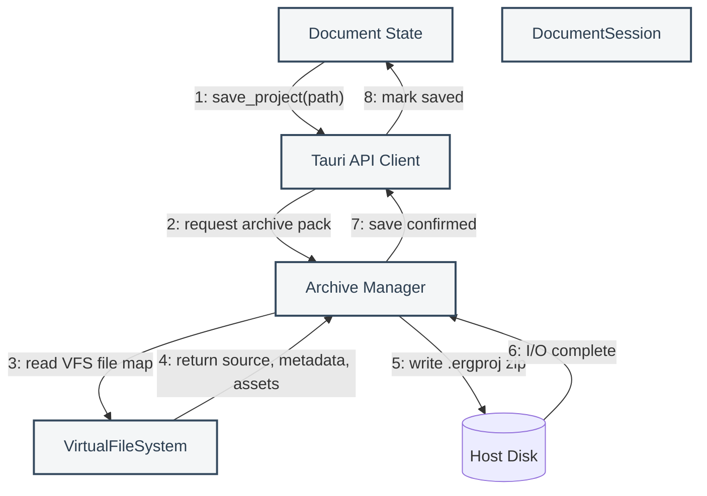
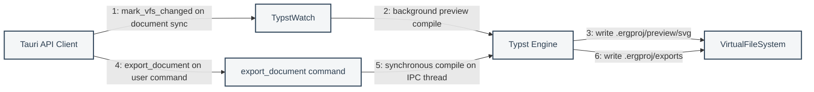

# Collaboration Diagrams

These diagrams emphasize the structural relationships and numbered messages between Érgo's major runtime objects.

## 1. Real-Time Editing And Preview

## 2. Save And Archive

## 3. Preview Watch Vs Export

## Collaboration Notes

- Bootstrap sends a document snapshot; normal edits, undo, and redo send typed document events, not canonical full Typst source or full AST snapshots.
- Saves pack the backend session's mounted VFS state. They do not receive a frontend AST payload.
- Dirty element fragments are cached in `DocumentSession`; section files assemble fragment includes.
- `VirtualFileSystem` is the compile surface. It normalizes paths and retains Typst `Source` objects for incremental parsing.
- `TypstWatch` owns background preview compilation. `export_document` is a separate synchronous export path.
- Resource catalog updates and resource preview SVG writes run from document sync handlers when snapshots or dirty resource IDs require them.
