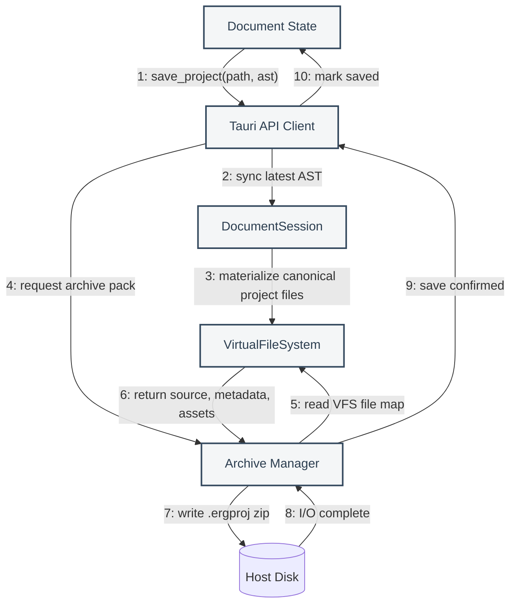
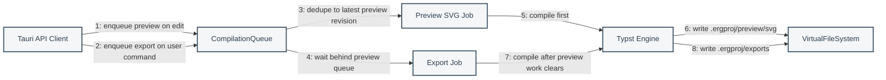

# Collaboration Diagrams

These diagrams emphasize the structural relationships and numbered messages between Érgo's major runtime objects.

## 1. Real-Time Editing And Preview

```mermaid
flowchart LR
    classDef comp fill:#f4f6f7,stroke:#34495e,stroke-width:2px,color:#2c3e50;

    User(("User"))
    UI["React UI"]
    Command["Command Registry"]
    State["Document State"]
    API["Tauri API Client"]
    Session["DocumentSession"]
    Cache["Fragment Cache"]
    VFS["Retained-Source VFS"]
    Queue["CompilationQueue"]
    World["ErgoWorld"]
    Typst["Typst Engine"]
    Preview["Preview Renderer"]

    User -- "1: edits document" --> UI
    UI -- "2: dispatches command/action" --> Command
    Command -- "3: updates AST" --> State
    State -- "4: sync_document_snapshot" --> API
    API -- "5: sends AST snapshot" --> Session
    Session -- "6: regenerates dirty fragments" --> Cache
    Session -- "7: writes main + section files" --> VFS
    API -- "8: enqueue_preview_compile" --> Queue
    Queue -- "9: compiles with world" --> Typst
    Typst -- "10: requests sources/files" --> World
    World -- "11: reads retained Source/Bytes" --> VFS
    Queue -- "12: writes preview SVG files" --> VFS
    Queue -- "13: emits preview page paths" --> API
    API -- "14: read_preview_svg" --> VFS
    API -- "15: supplies SVG text" --> Preview
    Preview -- "16: updates document view" --> User

    class UI,Command,State,API,Session,Cache,VFS,Queue,World,Typst,Preview comp;
```

## 2. Save And Archive

## 3. Preview Vs Export Queueing

## Collaboration Notes

- The frontend sends document snapshots/events, not canonical full Typst source, during normal editing.
- Dirty element fragments are cached in `DocumentSession`; dirty sections are assembled into section files.
- `VirtualFileSystem` is the compile surface. It normalizes paths and retains Typst `Source` objects for incremental parsing.
- `CompilationQueue` is responsible for dedupe, preview priority, stale-result dropping, and export ordering.
