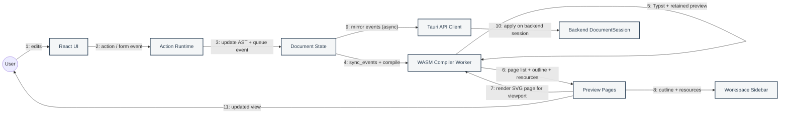

# Collaboration Diagrams

Structural relationships and numbered messages for the edit-compile loop only. All other flows are sequence diagrams — see `README.md`.

## Real-Time Editing And Preview

## Notes

- Normal edits send typed `DocumentEvent` batches to WASM; bootstrap uses `sync_document_snapshot`.
- Backend mirroring is fire-and-forget for archive consistency; preview latency does not wait on it.
- Save and autosave: `sequence-diagrams.md` §2.
- Export: `sequence-diagrams.md` §5.
