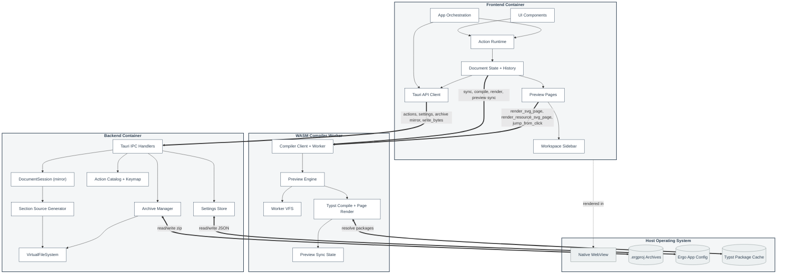

# Component Diagram

High-level runtime containers, responsibilities, and IPC boundaries for the React frontend, WASM compiler worker, Tauri/Rust backend, and host OS.

## Architecture Overview

Érgo is a local-first desktop application:

1. **Frontend (React / TypeScript / Vite):** UI, action context tree, local `DocumentAST` with undo/redo, template metadata form fields, a ProseMirror-controlled content-body editor (one view per content section), preview page rendering, and orchestration hooks.
2. **WASM Compiler Worker:** Hot-path `DocumentSession`, VFS, main and resource preview compiles, `PreviewSyncState`, page rendering, and export rendering (`ergo-engine-wasm` + `ergo-core`).
3. **Backend (Tauri / Rust):** Typed actions and keymap resolution, mirrored `DocumentSession` and VFS for archive I/O, settings persistence, and host file/dialog I/O.
4. **Host OS:** WebView, `.ergproj` archives, app config under `Ergo`, and Typst package cache.

**Editable state vs compilable source:** React updates `DocumentAST` immediately. The WASM worker owns canonical Typst materialization and all preview compiles. The backend `DocumentSession` mirrors AST snapshots and events over IPC for save/open only.

## Component Diagram

## Component Notes

- **Frontend UI** follows atomic layers under `src/components/`: atoms (native controls), molecules (`Dialog`, `DropdownMenu`, `MenuPanel`, shared fields), organisms (feature editors and dialogs), layout (menubar and workspace regions), screens (welcome). Organisms do not import layout modules; shared types (e.g. outline targeting) live in `src/editor/` or bindings, not in layout files.
- **Preview Engine** wraps `DocumentSession`, `preview_pipeline`, dual `ErgoWorld` instances (main + resource previews with comemo), `PreviewSyncState`, main page SVG serialization, and resource thumbnail SVG serialization.
- **Preview Pages** own DOM layout, viewport observation, SVG page replacement, click coordinate conversion, and compile-driven page scroll. Main pages and resource thumbnails write worker-returned SVG markup into stable page containers.
- **DocumentSession (mirror)** on the backend applies the same typed events as WASM so `save_project` packs a consistent VFS. It does not compile on the IPC sync path.
- **Tauri API Client** imports IPC DTOs only from generated `src/bindings/`.
- **Action Runtime** dispatches stable action IDs for commands and shortcuts; Rust owns catalog, keymap schema, sequence resolution, and context matching.
- **Document State + History** (`DocumentContext`) stores local AST, queued events, undo entries `{ forwardEvents, inverseEvents }`, and focus state. `dispatch` and body `commitDocumentEvents` both commit through `COMMIT_EVENTS` and `applyDocumentEvents`; WASM compile is the hot path; the Tauri backend VFS mirror runs on bootstrap and before save, not per keystroke.
- **Archive Manager** packs the backend VFS on save; open mounts files and bootstraps from `.ergproj/document_state.json`.
- **VirtualFileSystem** retains Typst `Source` for text paths and bytes for assets; paths use `/` separators.
