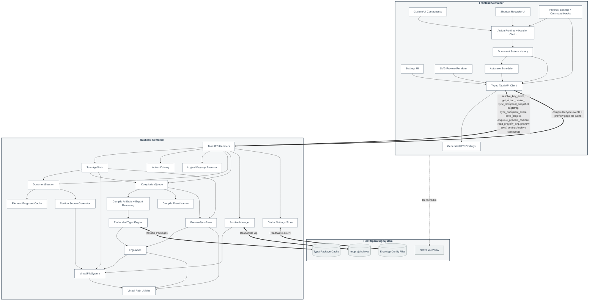

# Component Diagram

This document is the high-level component design for Érgo. It describes the logical containers, their responsibilities, and the main IPC boundaries between the React frontend, the Tauri/Rust backend, and the host operating system.

## Architecture Overview

Érgo is a local-first desktop application:

1. **Frontend Container (React / TypeScript / Vite):** Owns the interactive UI, live action context tree, focused handler chain, local document editing state, undo/redo history, settings UI, and live preview rendering.
2. **Backend Container (Tauri / Rust):** Owns typed action definitions, keymap schema/validation, logical-key sequence resolution, canonical Typst source materialization, retained in-memory Typst sources, retained preview documents for sync, project archive I/O, compile queue scheduling, embedded Typst compilation, SVG/PDF/PNG export, and global settings persistence.
3. **Host OS Layer:** Provides the native WebView, local project files, app config files under the platform config root's `Ergo` folder, package cache, and installer/runtime environment.

The current architecture intentionally separates **editable document state** from **compilable Typst source**:

- React updates the `DocumentAST` immediately for responsive editing.
- Rust `DocumentSession` receives a bootstrap snapshot for cold loads, then applies typed document events for edits, undo, and redo.
- Rust `VirtualFileSystem` keeps retained `typst_syntax::Source` objects for incremental Typst parsing.
- The compile queue compiles from VFS-backed `ErgoWorld`, writes SVG preview files, and emits lifecycle events.
- The frontend preview loads SVG page files from the backend.
- Preview/editor synchronization uses the latest successful, non-stale compiled `PagedDocument` retained in Rust, not SVG DOM attributes.

## Component Diagram

## Component Notes

- **DocumentSession** is the backend coordination point for the canonical backend AST, bootstrap snapshots, typed document events, dirty tracking, fragment cache updates, section-file assembly, source-map generation, and VFS writes.
- **Typed Tauri API Client** imports IPC DTOs only from generated `src/bindings/` files. The frontend must not keep hand-written mirrors for backend DTOs.
- **Project / Settings / Command Hooks** keep root UI orchestration separated by concern: project lifecycle, settings lifecycle, autosave, command palette state, app action handlers, compile-event bridging, and SVG page loading.
- **Document State + History** keeps the immediate React AST mirror and stores each edit as `{ forwardEvent, inverseEvent, previousAst, nextAst }`. Undo sends the inverse event; redo sends the forward event. Destructive inverse events carry restore payloads and exact positions.
- **Editor Field Registry** registers editable form fields by stable field IDs. `DocumentFocusState` drives focus and caret placement from React state, and field components apply selection inside layout effects.
- **Action Runtime + Keymap Resolver** follow a Zed-inspired action model. Rust owns typed action IDs, the action catalog, keymap JSON schema, validation, logical-key normalization, multi-stroke sequence state, and context-expression matching. React owns the live context tree and executes handlers from the focused context upward through parent contexts.
- Every mouse-performable command must dispatch a stable action ID such as `workspace::OpenProject`; clicking the UI surface and pressing the matching shortcut both produce an `ActionInvocation`. Raw text editing remains native input plus typed document events.
- Key bindings use logical keys from `KeyboardEvent.key`, not physical key positions. Multi-stroke sequences such as `Ctrl+O Ctrl+O` and `Ctrl+O Ctrl+R` are supported. Default keymaps must avoid assigning an action to a prefix stroke that is also used by longer sequences; users may intentionally create that ambiguity in settings, in which case the resolver waits for the sequence timeout before running the prefix fallback. If more than one binding matches, the most specific active context expression wins.
- The frontend must not keep a separate shortcut resolver or canonical Typst generator. It may keep a small action-handler adapter for UI labels, enablement, and React-owned side effects until those pieces are fully derived from the Rust action catalog.
- **Settings Store** reads installed default JSON resources first and persists user overrides under the platform config root's `Ergo` folder. Bundled defaults live at `defaults/default_settings.json` and `defaults/default_keymap.json`; user settings live at `settings.json` and `keymap.json`. Default keymap bindings come from bundled resources; user keymap files and the keymap settings UI store overrides.
- **Autosave Scheduler** is controlled by global settings. It waits for the serialized document event sync loop before calling `save_project(path)`, saves dirty projects on a configurable interval, and can also save when the app window loses focus, when the app window is closing, or when the active project is closing because the user closes it or opens/creates another project.
- **VirtualFileSystem** stores canonical Typst/text sources as retained Typst `Source` objects plus revisions. It stores generated preview SVGs, exports, assets, and other non-source artifacts as file bytes. Paths are normalized to `/` so Typst includes work consistently across Windows and Linux.
- **CompilationQueue** is the only scheduler for preview and export compilation. Preview SVG jobs have priority over export jobs.
- **Compile Artifacts + Export Rendering** owns Typst compilation snapshots, `typst-svg` page rendering, changed-page VFS writes, and PDF/PNG/SVG export artifact generation. `CompilationQueue` owns scheduling and lifecycle status; Tauri compiler commands are IPC glue.
- Local monotonic counters and revisions stay as `u64` internally in Rust and are exported through `ts-rs` as TypeScript `number` values. They are session-local counters and must not approach JavaScript's `Number.MAX_SAFE_INTEGER`.
- Preview debounce is disabled by default. Global settings can enable it and provide the debounce time sent to the queue when preview work is enqueued.
- **ErgoWorld** implements Typst's `World` trait for compilation and Typst IDE's `IdeWorld` trait for source-to-preview mapping.
- **PreviewSyncState** retains the latest successful, non-stale `PagedDocument` plus element source-map, field source-map, Typst source snapshot, and page metrics. Preview clicks call Typst IDE jump APIs on that retained document and retained sources, then map returned file offsets to Érgo field targets.
- **Preview Renderer** treats SVG page files as canonical preview output. It reloads only page files marked as changed by the backend, converts click positions from SVG viewBox space into Typst page coordinates, and dispatches `editor::FocusField` when backend sync returns an Érgo focus target.
- **Archive Manager** writes and opens `.ergproj` archives. Save commands pack the current backend session's VFS state and do not receive a frontend AST payload. `.ergproj/document_state.json` is required, and source files are materialized from that structured document state on open.
