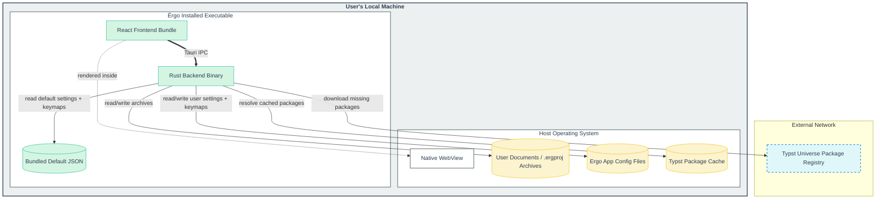

# Distribution Diagram

This document describes Érgo's deployment topology, storage boundaries, project archive format, and generated-artifact locations.

## Deployment Topology

Érgo is distributed as a native desktop app for Windows and Linux. It uses the OS WebView for the React frontend and a Rust/Tauri backend for file I/O, Typst compilation, settings, and archive management.



## `.ergproj` Archive Layout

An Érgo project file is a zip archive. The canonical project layout is:

```text
main.typ
sections/
  {section-id}.typ
assets/
references.bib
.ergproj/
  document_state.json
  dependency_manifest.json
  project_settings.json
  template.json
  source_map.json
```

### File Responsibilities

- `main.typ`: small Typst entry point containing template/preamble setup and includes for section files.
- `sections/{section-id}.typ`: generated Typst source for one document section. Cover page, content, appendices, and template-defined sections all use section files.
- `assets/`: project-local binary assets such as images.
- `references.bib`: generated bibliography file from structured reference entries.
- `.ergproj/document_state.json`: canonical structured document AST snapshot.
- `.ergproj/dependency_manifest.json`: required Typst package declarations.
- `.ergproj/project_settings.json`: per-project settings overrides.
- `.ergproj/template.json`: template identity and template metadata needed to reopen/generate the project.
- `.ergproj/source_map.json`: generated mapping from Érgo IDs to Typst source ranges.

Generated preview and export artifacts may exist under these VFS paths:

```text
.ergproj/preview/svg/page-{n}.svg
.ergproj/exports/
```

These are cache/output artifacts. They can be regenerated from the canonical source-of-truth files and must not be required to reopen the project.

Runtime preview sync state is not part of the archive. The backend retains the latest successful, non-stale compiled `PagedDocument`, page metrics, source-map snapshot, and Typst source snapshot in memory so editor-preview sync can use Typst IDE jump APIs against the same sources that produced the displayed preview. Saving or reopening a project regenerates that runtime state through the normal preview compile path.

## Online And Offline Modes

- **Online mode:** The archive stores dependency metadata and relies on the local Typst package cache, downloading missing packages when needed.
- **Offline mode:** The archive bundles required package sources/assets so the project can compile without internet access.

The initial implementation may only partially support offline bundling. When implementing archive work, keep the layout compatible with both modes.

## Storage Notes

- Global settings are app-level preferences and live outside project archives.
- The visible app name is `Érgo`, but the user config folder is named `Ergo` for predictable ASCII filesystem paths.
- App-level user configuration is stored as separate JSON files in the platform config root under the `Ergo` folder:
  - Windows: `%APPDATA%\Ergo\`
  - Linux: `$XDG_CONFIG_HOME/Ergo/` or `~/.config/Ergo/`
- `settings.json`
- `keymap.json`
- Preview debounce is disabled by default. When enabled, the app reads `preview_debounce_ms` from global settings and passes that delay to the backend preview queue.
- Bundled default configuration is installed with the app resources:
  - `defaults/default_settings.json`
  - `defaults/default_keymap.json`, including the default action bindings
- Keymap files use the Rust-owned schema:
  - `action_id`: typed action name such as `workspace::OpenProject`
  - `context`: expression such as `app`, `workspace && !input`, or `element && element.kind == "Table"`
  - `sequence`: ordered logical key strokes using `key` from `KeyboardEvent.key` and modifiers `Control`, `Alt`, `Shift`, `Meta`
- Bundled defaults should reserve prefix strokes for sequences. The default open-project binding is `Ctrl+O Ctrl+O`, while open-recent is `Ctrl+O Ctrl+R`; a bare `Ctrl+O` is not assigned by default.
- Keymap overrides can be customized either by editing `keymap.json` or through the keymap settings UI; both paths persist to the same user file. Older `keys`/`scope` entries are migrated when loaded and saved back using the new schema.
- Project settings live inside `.ergproj/project_settings.json`.
- The VFS is the active in-memory compile surface. Disk archives are persistence snapshots.
- Preview SVG page files are updated page-by-page. The backend compares rendered SVG text with the VFS copy, writes changed pages, and reports `changed` in preview page metadata.
- Paths inside the archive and VFS should use `/` separators, even on Windows.
