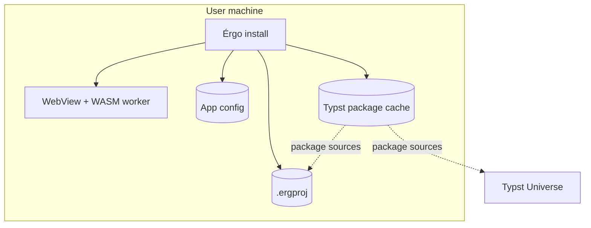

# Distribution Diagram

Deployment topology, `.ergproj` layout, config files, and storage boundaries.

## Deployment Topology

Érgo ships as a native desktop app (Windows, Linux) using the OS WebView for the React UI and a Rust/Tauri backend for file I/O, settings, and archives. Typst compilation runs in a bundled WASM module inside the WebView worker.



Install artifacts (React bundle, Tauri backend, WASM module, bundled default JSON) ship inside **Érgo install**. Runtime containers and IPC boundaries are in `component-diagram.md`.

## `.ergproj` Archive Layout

Zip archive canonical layout:

```text
assets/
  diagrams/
packages/
  {namespace}/{name}/{version}/...
umb-apa/
  lib.typ
  utils/...
versatile-apa/
  lib.typ
  utils/...
.ergproj/
  document_state.json
  dependency_manifest.json
  project_settings.json
  template.json
  template_spec.json
  source_map.json
  field_source_map.json
```

| Path | Role |
|------|------|
| `assets/` | Binary files referenced by `AssetEntry`, including durable generated diagram SVGs under `assets/diagrams/` |
| `packages/` | Mirrored registry Typst package files needed for offline WASM compilation |
| `umb-apa/`, `versatile-apa/` | Embedded path-imported template Typst packages (frozen per project on save) |
| `.ergproj/document_state.json` | Canonical structured AST (required on open) |
| `.ergproj/source_map.json` | Element → Typst byte ranges |
| `.ergproj/field_source_map.json` | Field → Typst byte ranges and UTF-16 segments |
| `.ergproj/template.json` | Template identity and variant (summary) |
| `.ergproj/template_spec.json` | Full `TemplateSpec` manifest snapshot used for source generation |

Optional cache paths (regenerable, not required to reopen):

```text
.ergproj/exports/
```

Preview pixels, `PreviewSyncState`, and export files are cache artifacts. They are not archive-authoritative.
Typst sources such as `main.typ`, `lib.typ`, `elements/{id}.typ`, `references.bib`, and `resources.typ` are runtime VFS materializations derived from `.ergproj/document_state.json` and the embedded `.ergproj/template_spec.json`.
Projects reopen with their saved template snapshot; the app bundle is used only when a project has no embedded template files yet.

## App Configuration

Global settings outside project archives:

| Location | Files |
|----------|-------|
| Windows `%APPDATA%\Ergo\` | `settings.json`, `keymap.json` |
| Linux `$XDG_CONFIG_HOME/Ergo/` or `~/.config/Ergo/` | same |

Bundled install resources:

- `defaults/default_settings.json`
- `defaults/default_keymap.json`

Per-project overrides: `.ergproj/project_settings.json`.

## Online And Offline

- `dependency_manifest.json` references packages resolved from the mirrored project VFS first, then the local Typst package cache.
- Archive package sources use `packages/{namespace}/{name}/{version}/...` paths so the WASM worker can compile without direct host-cache access.
- External package download belongs to the Typst package cache outside the archive.

## Storage Notes

- VFS paths use `/` separators on all platforms.
- Saves pack durable project state from the backend session VFS after worker sync and backend mirror sync drain.
- Autosave defaults are controlled in global `settings.json` (`autosave_interval_ms`, blur/close toggles).
- Keymap schema: `active_profile_id`, `profiles[]` (`id`, `name`, `overrides`), plus bundled `keymap_bindings` (`action_id`, `context` expression, `sequence` of logical keys with modifiers). Legacy `keymap_overrides` migrates into a `custom` profile on load.
