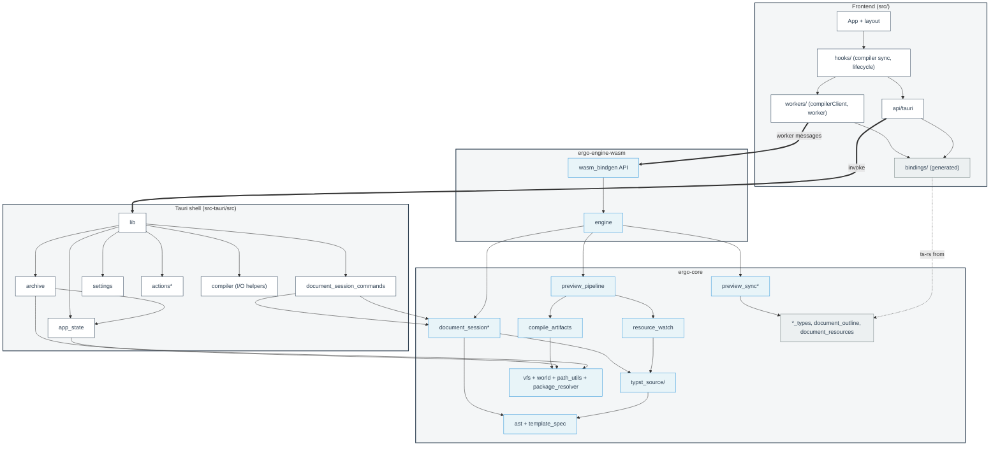

# Package Diagrams

Source-module ownership and allowed dependency direction.

## Package Notes

- `api/tauri` is the only frontend module that calls Tauri `invoke`.
- `workers/compiler.worker` loads `ergo-engine-wasm`; preview compiles never go through Tauri IPC.
- `document_session_commands` mirrors AST to the backend session; architecture tests forbid `compile_document` on that path.
- `ergo-core` owns Typst compilation, preview pipeline, preview sync, and Typst package cache resolution.
- `typst_source/` owns canonical Typst materialization: `lib.typ`, per-element fragments, references, source-map field formatting, fragment hashing inputs, and low-level Typst literal formatting.
- `document_session*` owns AST snapshot/event orchestration, incremental fragment cache checks, project source layout assembly, and VFS writes.
- `archive` packs the backend VFS and asks `ergo-core` for template package files; `compiler` commands handle font loading, source writes, and `write_bytes_to_path`.
- `actions*` owns catalog, context expressions, keymap validation, and per-window sequence state.
- IPC DTO crates export via `ts-rs` into `src/bindings/`; frontend must not hand-maintain binding mirrors or consume generated files from crate-local paths.
