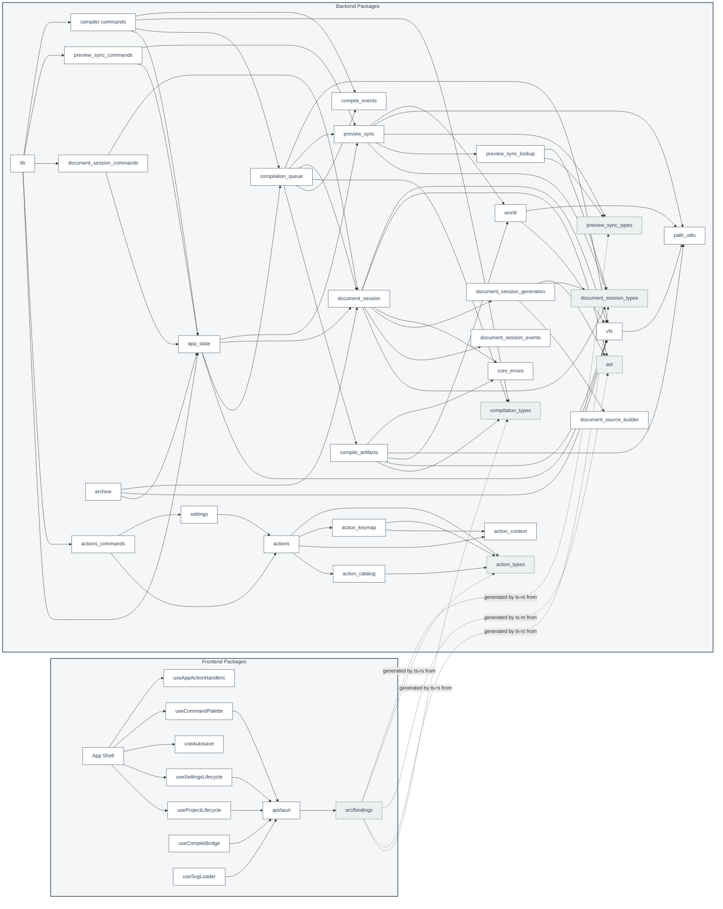

# Package Diagrams

This document describes source-module ownership and allowed dependency direction. It exists so module-level coupling rules do not leak into component, class, sequence, state, or distribution diagrams.

The package diagram is a design source of truth, not a history of refactors. It should describe the intended current architecture.

## Package Notes

- `App Shell` composes focused lifecycle hooks. It should not re-implement project, settings, autosave, command palette, compile, or SVG loading details inline.
- `api/tauri` is the only frontend package that calls Tauri `invoke`. It imports IPC DTOs from generated `src/bindings/` files.
- `src/bindings/` is generated by Rust `ts-rs` exports. Frontend code must not keep hand-written DTO mirrors.
- `app_state` owns shared backend runtime handles. Backend command modules depend on it instead of defining their own shared state.
- Backend command modules own Tauri command attributes and `State` extraction. Core modules do not import Tauri command state.
- `actions` owns key event resolution state. `action_catalog`, `action_context`, and `action_keymap` own action descriptors, context expression evaluation, and keymap validation.
- `document_session` owns session state and VFS coordination. `document_session_events`, `document_session_generation`, and `document_source_builder` own AST event application, Typst source materialization, and field source mapping.
- `preview_sync` owns retained preview documents. `preview_sync_lookup` owns source-map and field-map offset resolution.
- `compilation_queue` owns scheduling. `compile_artifacts` owns Typst compilation, SVG page rendering, changed-page VFS writes, and export artifact generation.
- `compile_events` owns compile lifecycle event names.
- `compilation_types`, `document_session_types`, `preview_sync_types`, `action_types`, and `ast` export IPC-facing TypeScript bindings through `ts-rs`.
- `path_utils` owns virtual path normalization and `FileId` conversion. VFS, world, preview sync, and artifact code should reuse it instead of duplicating path logic.
