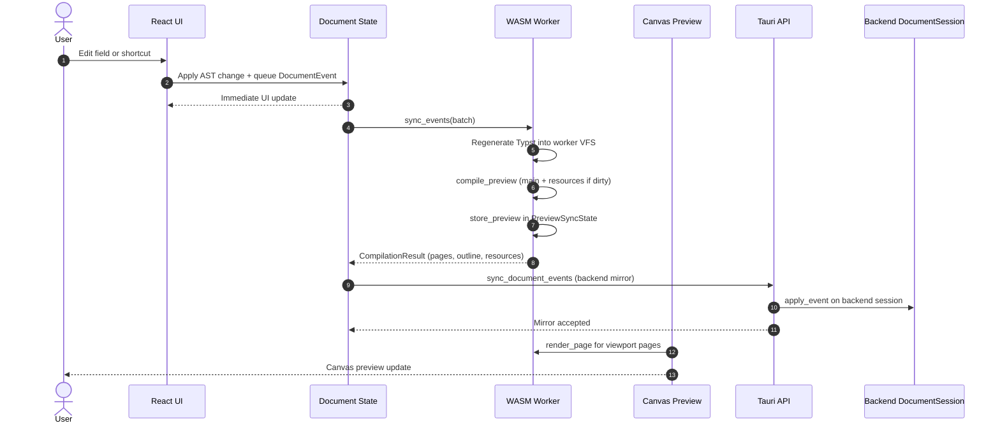
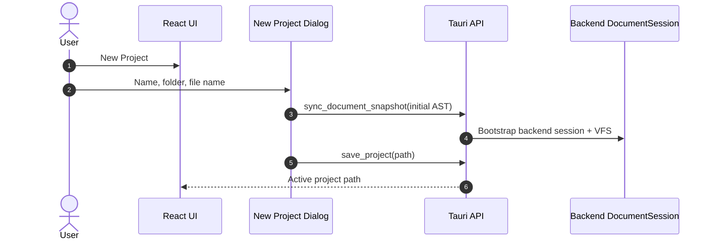
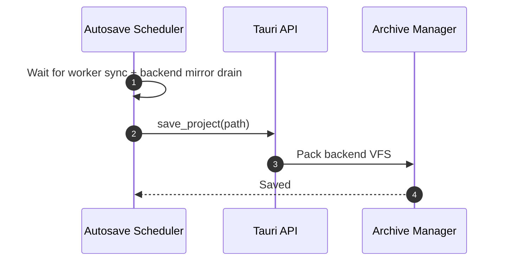
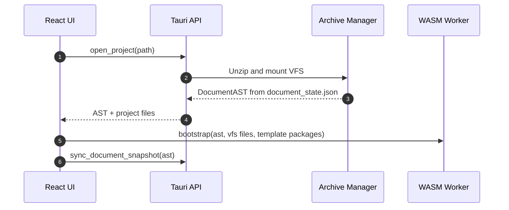
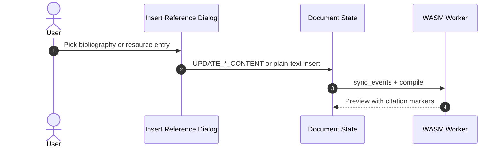
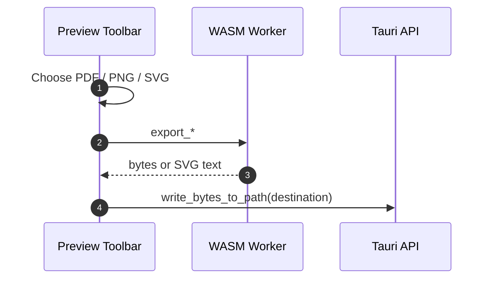
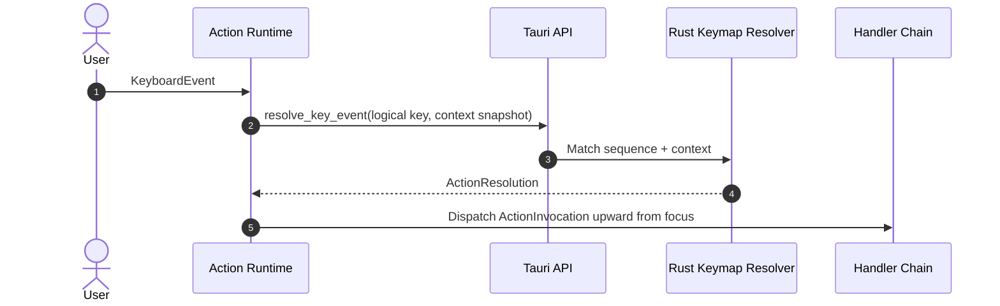
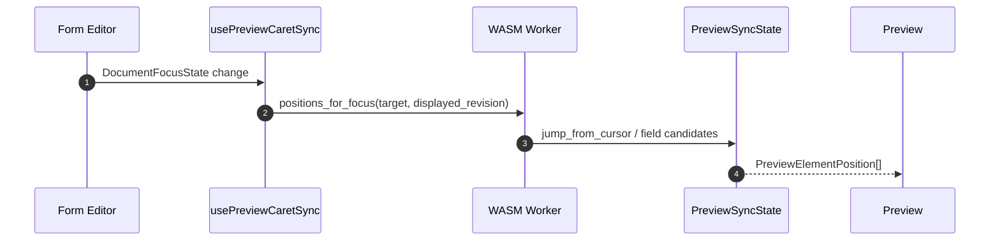

# Sequence Diagrams

Chronological flows. See `README.md` for which file owns each topic.

## 1. Real-Time Editing And Preview

- Bootstrap (open/new project): `CompilerClient.bootstrap` and `sync_document_snapshot` both complete before the document sync barrier drains.
- Queued document events are acknowledged after the backend mirror accepts the same batch.
- Main preview and resource previews compile in WASM via `preview_pipeline`.
- Canvas rasterizes only viewport pages; zoom debounces per `preview_zoom_render_debounce_ms`.
- Preview does not shift layout with compile-status chrome while typing.
- **Undo/redo:** apply the stored `inverseEvent` / `forwardEvent` locally, then sync and mirror that same event. Destructive inverses carry restore payloads (`RestoreElement`, `RestoreTableRow`, `RestoreTableColumn`).

## 2. Archive Save And Autosave

New project:

Pack archive (manual save and all autosave paths):

**Autosave triggers** (global `settings.json`): periodic interval, window blur, project close, app close. Each trigger uses the pack sequence when the project is dirty. Canonical archive paths are in `distribution-diagram.md`.

## 3. Archive Open

## 4. Insert Reference

## 5. Export

PNG and SVG target the current preview page index.

## 6. Keymap Resolution

Mouse commands use `dispatchAction` with the same action IDs. Keymap persistence: bundled defaults under app resources; overrides in `%APPDATA%/Ergo/keymap.json` (or XDG equivalent).

## 7. Preview And Editor Sync

Backward (preview click → editor):

Forward (editor focus → preview caret):

- Requests use the **displayed** preview revision, not the newest in-flight compile.
- Backward sync prefers `FieldSourceMapEntry`, then element `SourceMapEntry`.
- Forward sync resolves every preview occurrence of the focused field, then picks the caret position whose source offset is closest to the editor caret; when offsets tie, it prefers the page nearest the current preview anchor, then vertical position.
- Template project inputs use field ids `project-input-` + JSON pointer; backend `field_id` uses the pointer (e.g. `/title`).
- `editor::FocusField` is a stable action shared by preview clicks and sidebar navigation.
