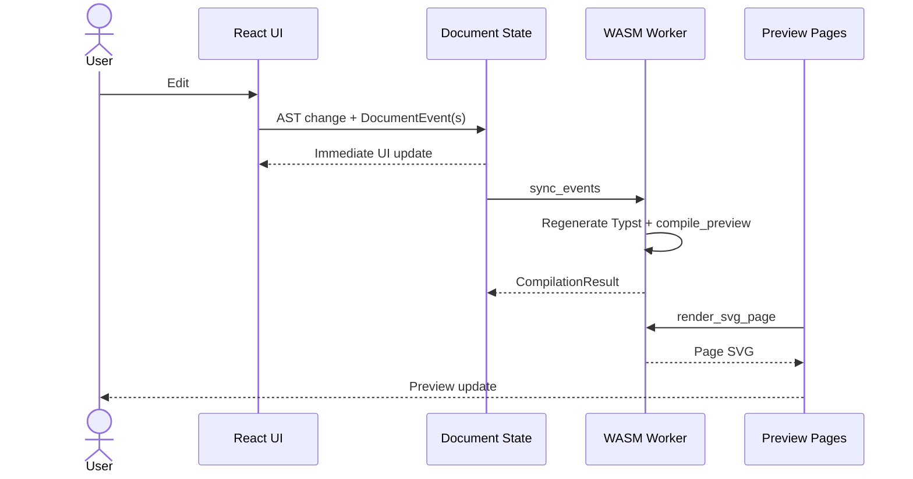
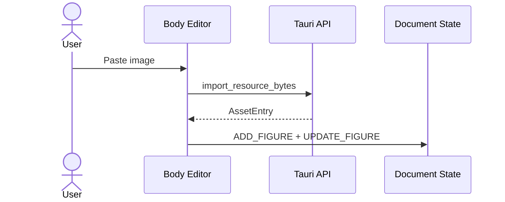
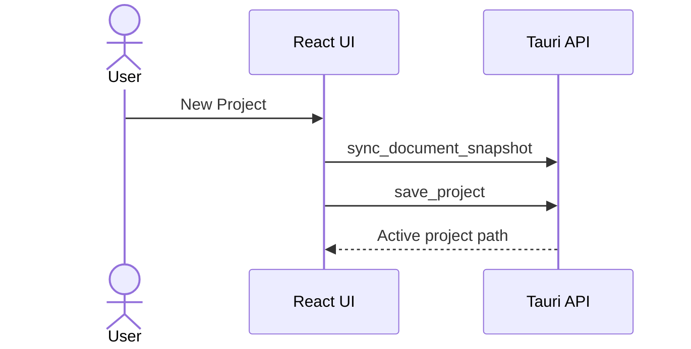
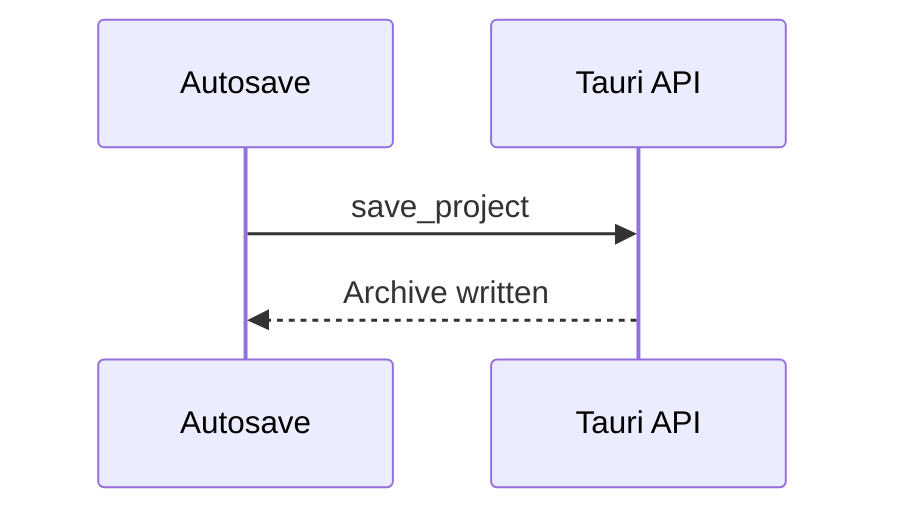
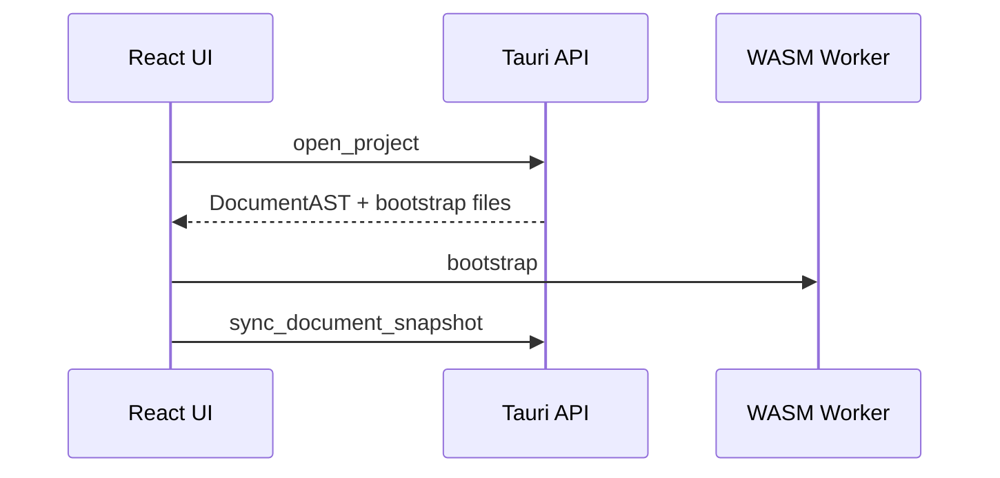
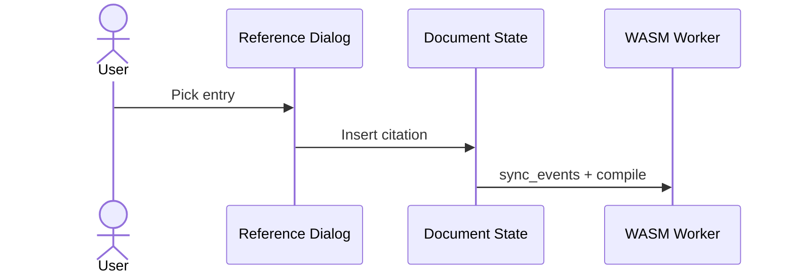
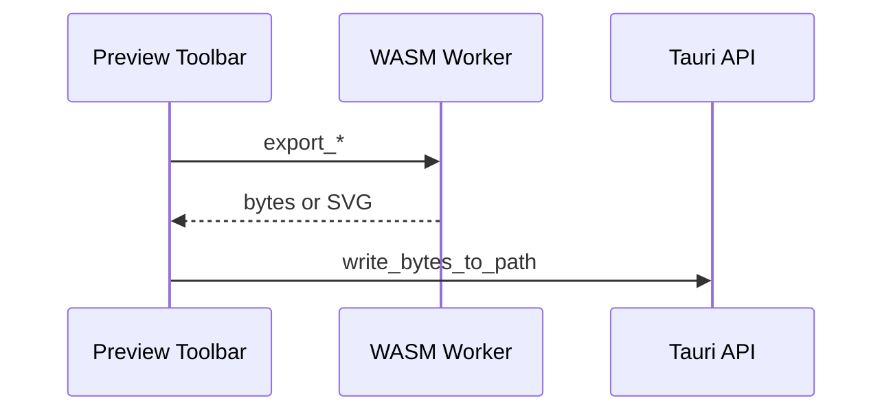
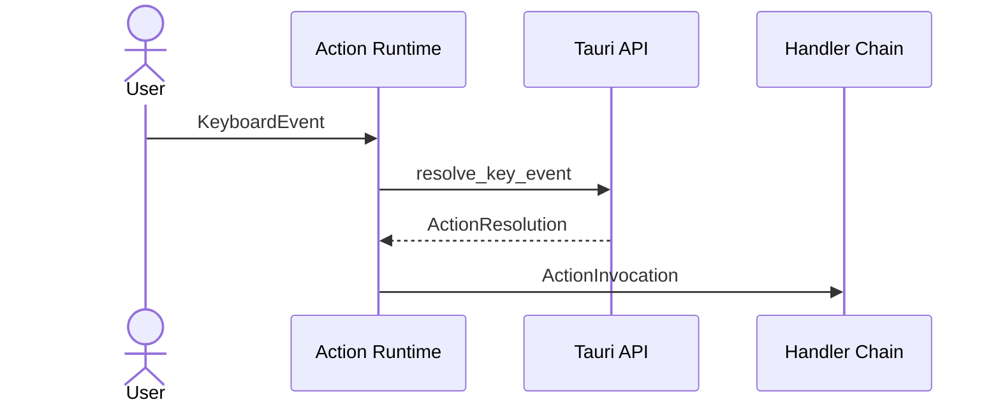
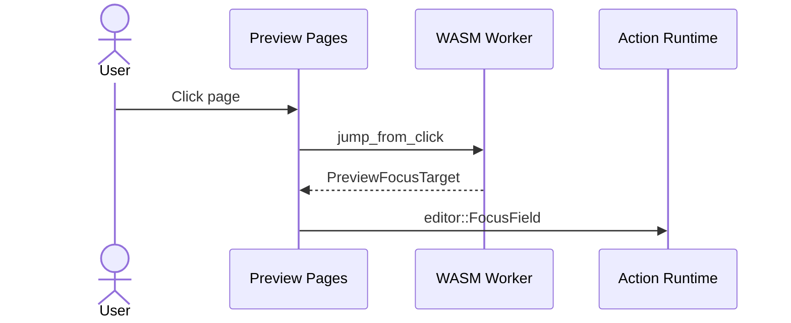
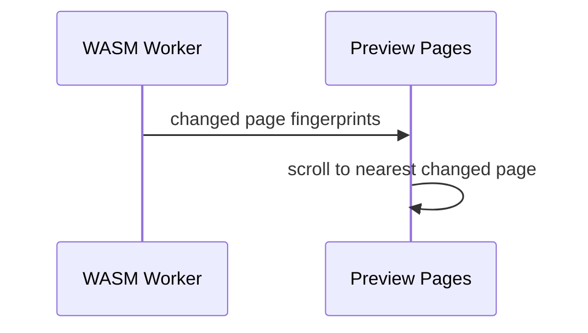

# Sequence Diagrams

Chronological flows. See `README.md` for which file owns each topic.

## 1. Real-Time Editing And Preview

- Bootstrap (open/new project): `CompilerClient.bootstrap` clears the WASM VFS and `DocumentSession`, resets compiled preview state, resets WASM fonts, awaits lazy load of non-bundled project font families (all faces per family), then compiles; `sync_document_snapshot` on the backend completes before the document sync barrier drains. The UI clears preview pages on `sessionId` change and ignores compile results from a prior session. Edits compile without reloading fonts.
- Queued document events are acknowledged after WASM sync and compile succeed. The Tauri backend VFS is mirrored on bootstrap (`sync_document_snapshot`) and again before save via the document sync barrier (`sync_document_snapshot` when dirty), not on every keystroke.
- The WASM preview session materializes only the files Typst compiles (`main.typ`, `lib.typ`, per-element `elements/*.typ`, `references.bib`). The `.ergproj/*.json` sidecars are written only by the backend session, which owns archive I/O. The field source map is worker-internal; the main thread consumes `source_revision`, `source_map`, and `dirty_resource_ids` from a sync.
- `sync_document_events` applies the full event batch with one `apply_events` call (one source regeneration), matching the WASM worker.
- Main preview and resource previews compile in WASM via `preview_pipeline`.
- Resource preview VFS uses the same `lib.typ` and `#show: apply` as the main document; `resources.typ` adds preview page dimensions and `#set page` / `#show page` overrides for a white background without headers or numbering. Sidebar thumbnails cap height at 40vh.
- Compiled outline comes from `document.introspector` on the paged document using the same heading filter as the PDF bookmark panel (`bookmarked: true`, or `bookmarked: auto` with `outlined: true`). The sidebar lists every compiled entry; editor headings match by text (including empty → `Untitled heading`), and other entries scroll the preview to that page.
- Incremental `compile_preview` returns page metadata only (no inline SVG). Bootstrap may inline the first page for a single-trip initial paint. Visible changed pages fetch SVG via `render_svg_page`.
- Main preview pages render only viewport pages whose content changed; unchanged visible pages keep their existing `innerHTML`. Zoom updates page layout without requesting a page rerender.
- Resource thumbnails use `render_resource_svg_page` and wait for the matching main preview revision to paint before replacing thumbnail SVG.
- Failed compiles report localized toast notifications and keep the last successful preview-visible pages, outline, resources, source map, and preview revision.
- Preview does not shift layout with compile-status chrome while typing.
- **Undo/redo:** apply the stored `inverseEvents` / `forwardEvents` locally, queue them for WASM `sync_events`, and mark the backend mirror dirty. Destructive inverses carry restore payloads (`RestoreElement`, `RestoreTableRow`, `RestoreTableColumn`).
- Backend mirror (async): `State->>API: sync_document_events` then `API->>Session: apply_events`. See `collaboration-diagrams.md`.

### Body clipboard paste

- Handlers live under `src/editor/clipboard/`; each handler exposes `canHandle` and `handle` so future formats register without changing the ProseMirror plugin.
- Image paste follows `TemplateSpec.typst.resources.pasted_image.behavior` (`figure` inserts a figure with `asset_id` set).
- Asset paths use the same `assets/{name}` collision rules as `import_resource_file`.
- Paste is handled in the body editor only; nested table-cell editors keep native text paste until a dedicated handler exists.

## 2. Archive Save And Autosave

New project:

Pack archive (manual save and all autosave paths):

**Autosave triggers** (global `settings.json`): periodic interval, window blur, project close, app close. Each trigger uses the pack sequence when the project is dirty. Canonical archive paths are in `distribution-diagram.md`. Save waits for worker sync and backend mirror drain before packing.

## 3. Archive Open

## 4. Insert Reference

## 5. Export

PNG and SVG target the current preview page index.

## 6. Keymap Resolution

Mouse commands use `dispatchAction` with the same action IDs. Keymap persistence: bundled defaults under app resources; user profiles and overrides in `%APPDATA%/Ergo/keymap.json` (or XDG equivalent). Document undo/redo uses AST history (`edit::Undo`, `edit::Redo`), not ProseMirror history. Resolution is deferred via microtask so synchronous ProseMirror handlers run first.

## 7. Preview And Editor Sync

Backward (preview click → editor):

Forward (compile → preview scroll):

- Requests use the **displayed** preview revision, not the newest in-flight compile.
- Backward sync prefers `FieldSourceMapEntry`, then element `SourceMapEntry`.
- Forward sync scrolls the preview to the changed page nearest the current viewport anchor after a compile. Manual preview scrolling suppresses auto-scroll until the next compile revision.
- `editor::FocusField` is a stable action shared by preview clicks and sidebar navigation.
