# Sequence Diagrams

This document describes chronological flows through Érgo's architecture. The primary path uses backend-owned Typst source materialization: React updates its local AST mirror, sends typed document events to Rust, Rust `DocumentSession` applies those events to its canonical AST, the retained-source VFS feeds Typst, and the frontend loads generated SVG page files.

## 1. Real-Time Editing And Preview Compilation

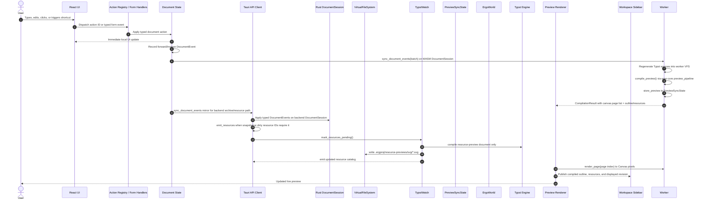

### Flow Notes

- The frontend does not own canonical full Typst source generation.
- `sync_document_snapshot(ast)` is a cold-path bootstrap for new/opened documents. Normal edits, undo, and redo use `sync_document_event(event)`.
- `patch_source` remains a lower-level VFS command for focused source edits, but normal document editing syncs typed events to `DocumentSession`.
- Main preview compiles in the WASM worker. Backend `TypstWatch` compiles resource-preview SVGs only.
- Preview page pixels are rendered on demand in the frontend Canvas; backend main-preview SVG artifacts are not used.
- Frontend Typst generation utilities must not be used in the compile path. Backend `DocumentSession` is the only canonical source generator.
- The Tauri API client uses generated `ts-rs` bindings for all IPC DTOs. Hand-written frontend DTO shadows are not part of the flow.
- The retained preview document is runtime state only. It contains the compiled `PagedDocument`, source-map snapshot, Typst source snapshot, and page metrics. It is kept for sync and discarded/replaced when a newer non-stale preview compile succeeds.
- Preview page SVG writes are page-granular. The backend artifact pipeline renders each Typst page through `typst-svg`, compares rendered SVG text with the VFS file bytes, writes only changed pages as generated file artifacts, and marks each `PreviewPageFile.changed` value. The frontend SVG loader keeps unchanged page SVG strings in memory and reloads only changed pages.
- After a successful preview compile, a `DocumentOutline` is extracted from `document.introspector` and attached to the `CompilationResult` emitted by the `COMPILE_SUCCEEDED` event. The preview hook stores the latest outline and the workspace sidebar renders it with heading text and compiled page numbers. Sidebar outline rows map to editor fields and ignore repeated compiled entries that would target the same field. Failed preview results carry `outline: null`.
- `DocumentResources` is emitted through `ergo-resources-updated` from document sync handlers. The backend derives imported-file, figure, table, equation, and custom resource rows from the canonical AST, compiles the resource preview document on the sync path when required, writes `.ergproj/resource-previews/svg/*`, and records per-resource preview failures without failing the main preview compile.

Undo and redo use the same event pipe:

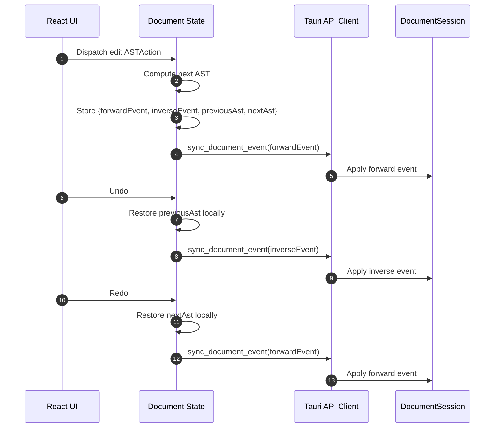

Destructive inverse events carry the removed payload and exact position. Examples include `RestoreElement { section_id, index, element }`, `RestoreTableRow { table_id, row_index, cells }`, `RestoreTableColumn { table_id, col_index, cells, size }`, and `RestoreAuthor { section_id, author_index, author }`.

## 2. Archive Save

New project creation starts with frontend setup before the first archive save:

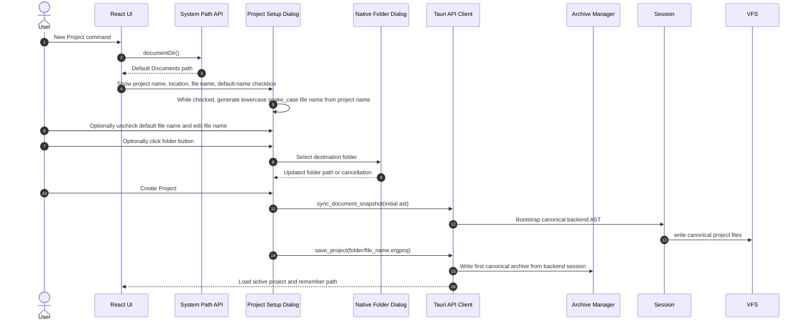

The generated project file name preserves accents and other non-ASCII letters, removes Windows-invalid filename characters, converts whitespace to `_`, lowercases the result, and appends `.ergproj` when missing. Manual file-name overrides still remove Windows-invalid filename characters and append `.ergproj`, but otherwise preserve the user's spelling.

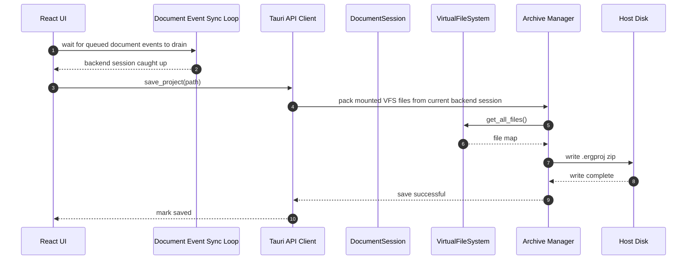

### Archive Source Of Truth

The canonical archive state is:

- `main.typ`
- `elements/{element-id}.typ`
- `assets/`: imported resource file bytes referenced by `AssetEntry` metadata.
- `references.bib`: materialized from form-managed `ReferenceEntry` values.
- `.ergproj/document_state.json`
- `.ergproj/dependency_manifest.json`
- `.ergproj/project_settings.json`
- `.ergproj/template.json`
- `.ergproj/source_map.json`

Generated preview, export, and resource-preview files may exist in the VFS, but they should be treated as cache artifacts and can be regenerated. `.ergproj/resource-previews/` is excluded from archive saves.

## 3. Archive Open

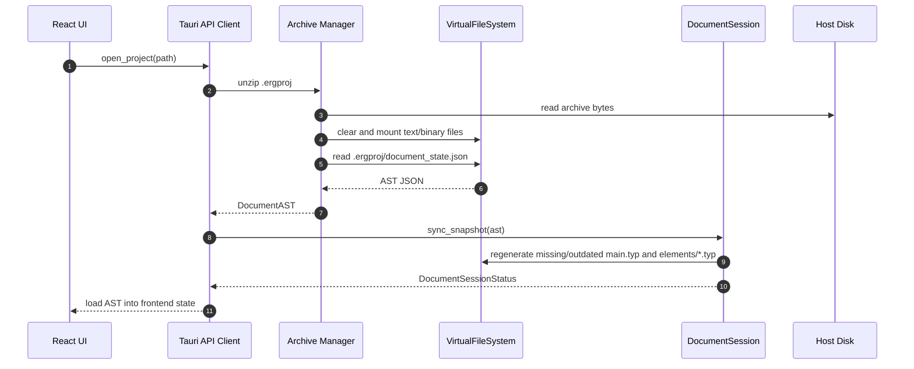

### Open Rule

`.ergproj/document_state.json` is required. The backend mounts archive files into the VFS, reads the structured document state, and materializes `main.typ`, element files, source maps, and metadata from that document state.

## 4. Autosave And Close Events

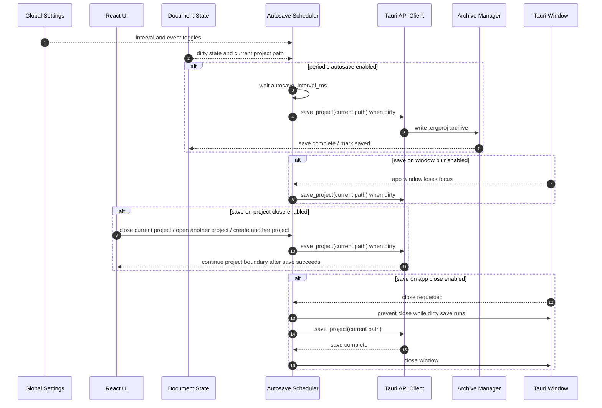

## 5. Export

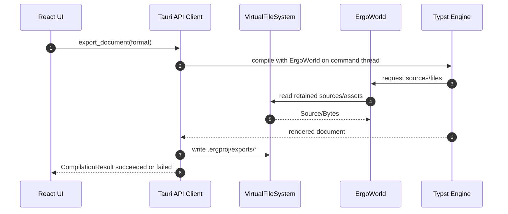

Export runs synchronously on the Tauri command thread. It does not pass through `TypstWatch`.

## 6. Keymap Resolution

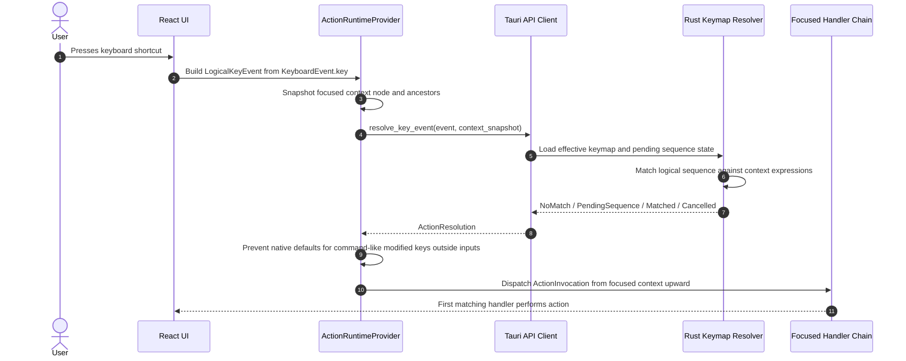

Mouse surfaces use the same registry path:

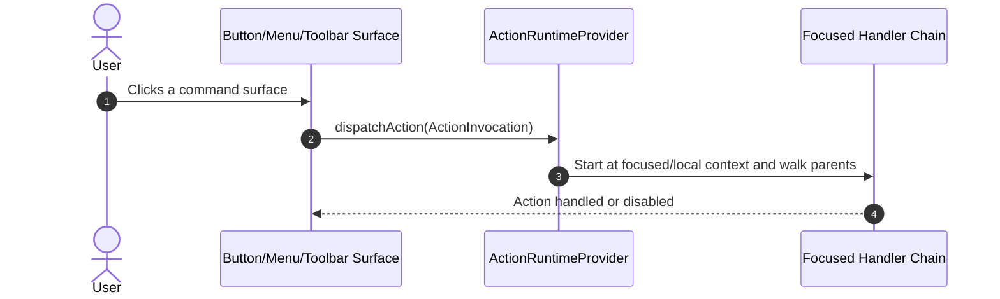

Every mouse-performable command-like operation should have a matching action. Action IDs use namespace-style names such as `workspace::OpenProject`; the namespace describes ownership, while the action context expression decides where the shortcut is valid. Raw typing inside form fields remains native input and document events, not actions.

Keymap settings are loaded from and saved to the app config file `keymap.json`, separate from general app settings in `settings.json`. The user config folder is named `Ergo`; bundled defaults live under the installed app resources as `defaults/default_keymap.json` and `defaults/default_settings.json`. The bundled keymap file owns default action bindings, while the user file persists profile selection and overrides. The keymap settings UI edits those overrides directly, so JSON customization and UI customization use the same strict schema.

There is no frontend fallback shortcut resolver. Keyboard events are normalized in React only to form `LogicalKeyEvent`; matching, pending-sequence state, fallback timeout decisions, and context-expression evaluation belong to Rust.

## 7. Preview And Editor Sync

Backward sync uses Typst's compiled frame tree rather than SVG attributes:

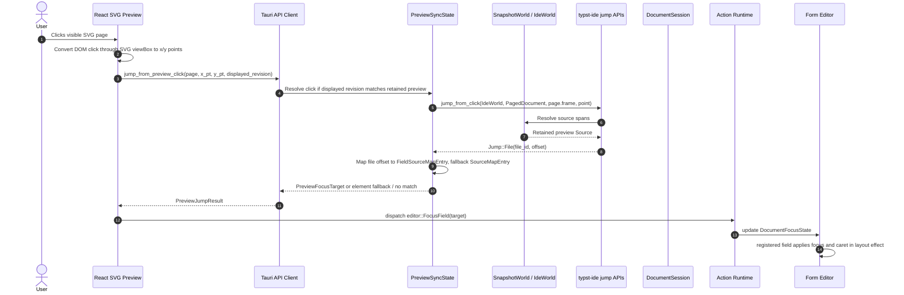

Forward sync starts from the form editor's focused field:

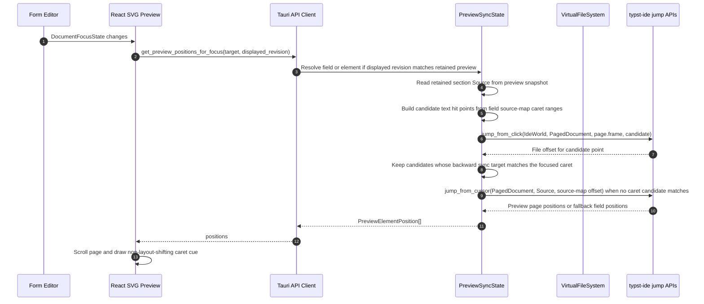

### Sync Notes

- Sync requests use the revision of the preview currently displayed, not the newest queued preview revision.
- Sync requests resolve against the preview revision that is actually displayed. Form edits made after that preview do not invalidate click sync for visible content because the retained preview includes its own Typst source snapshot.
- Newly added or newly rendered content cannot sync until a successful preview compile includes it.
- `Jump::Url` does not focus a form field in v1.
- Backward sync resolves clicks with Typst IDE frame hit testing and maps file offsets to field ranges first, then to element ranges.
- Forward sync caret cues use preview points that backward sync maps to the same field and UTF-16 caret offset. Field-level fallback positions use Typst IDE cursor-to-preview mapping.
- `editor::FocusField` is an action. Preview clicks, sidebar navigation, and other command-like focus surfaces dispatch the same `ActionInvocation`.
- `DocumentFocusState` stores `elementId`, `fieldId`, optional UTF-16 caret offset, preview revision, focus source, and a request id.
- Registered editor fields apply focus and caret placement from React state inside `useLayoutEffect`; preview sync does not mutate DOM selection directly.
- Project-level template inputs use editor field IDs prefixed with `project-input-` followed by the template input JSON pointer. Backend source-map ranges for those fields are owned by the `inputs` pseudo-element and use the JSON pointer as `field_id`, such as `/title`, `/running_head`, `/authors/0/name`, or `/affiliations/0`. Forward sync converts registered editor IDs to backend source-map IDs before calling preview sync, and backward sync converts backend input focus targets back to registered project input fields before updating `DocumentFocusState`.
- Template input collection and reference fields may map through related rendered fields when the raw stored value is not itself visible in the compiled document. For example, an author affiliation reference can resolve through the author's rendered name or the referenced affiliation label while keeping the focused field ID tied to the original template input path.
- Plain text fields can receive UTF-16 caret placement. Generated wrappers, references, inline equations, and rich segments that do not map to raw field text fall back to field-level focus with a safe caret offset.
- Typst labels remain stable source identifiers, but SVG output is not expected to contain Érgo-specific HTML data attributes.
