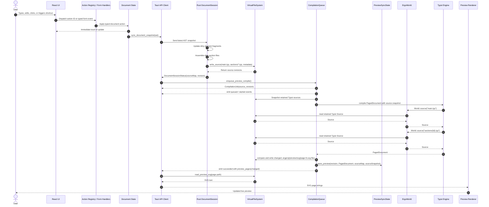
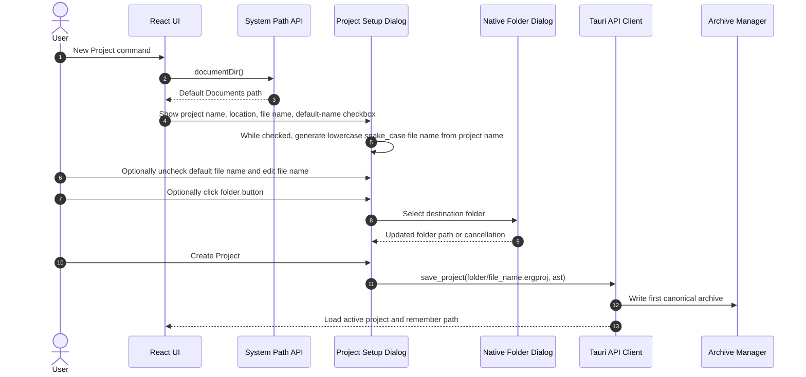
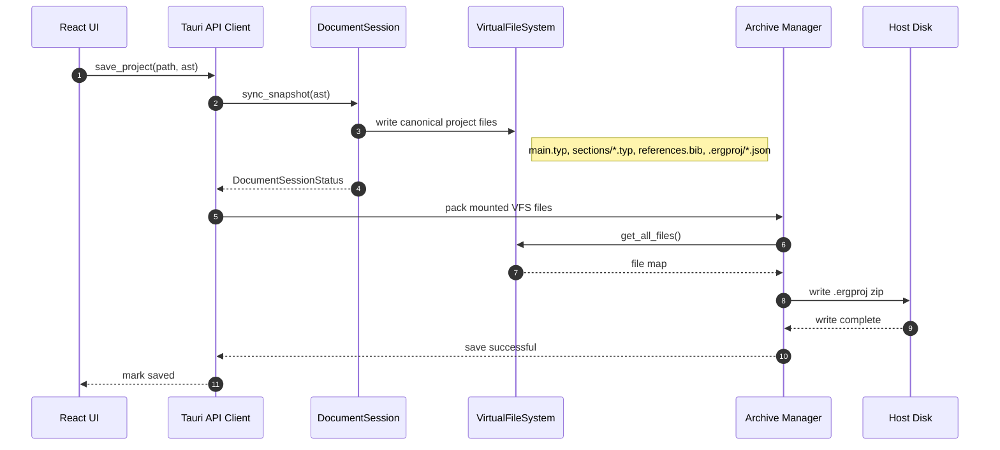
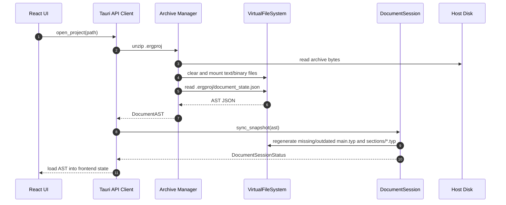
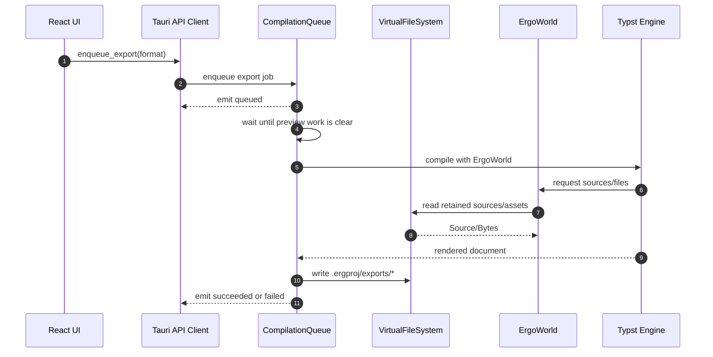
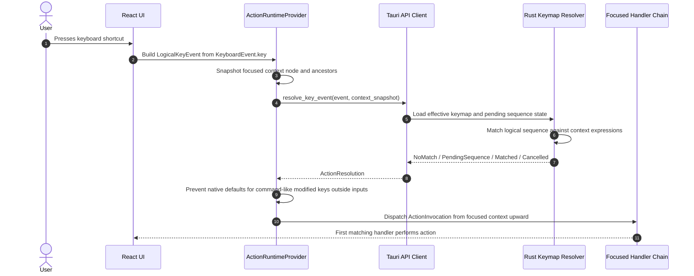
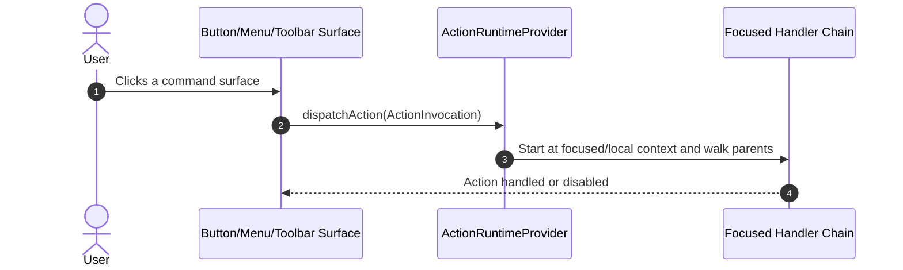
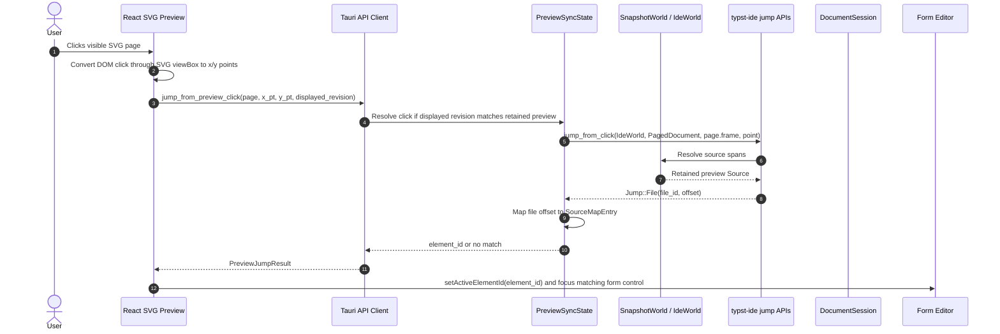
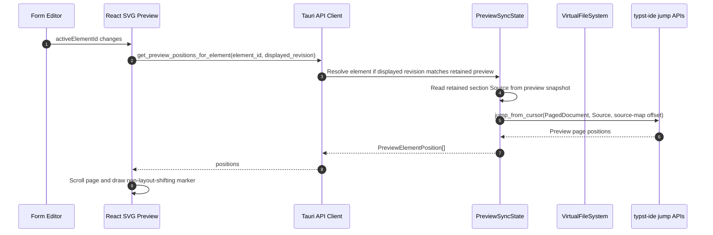

# Sequence Diagrams

This document describes chronological flows through Érgo's architecture. The primary path uses backend-owned Typst source materialization: React updates the AST, Rust `DocumentSession` generates section files, the retained-source VFS feeds Typst, and the frontend loads generated SVG page files.

## 1. Real-Time Editing And Preview Compilation

### Flow Notes

- The frontend does not own canonical full Typst source generation.
- `patch_source` remains a lower-level VFS command for compatibility and focused source edits, but normal document editing syncs AST snapshots/events to `DocumentSession`.
- The preview result must be rejected if its source revision is stale.
- Preview SVG files under `.ergproj/preview/svg/` are generated artifacts, not authoritative document state.
- Frontend Typst generation utilities must not be used in the compile path. Backend `DocumentSession` is the only canonical source generator.
- The retained preview document is runtime state only. It contains the compiled `PagedDocument`, source-map snapshot, Typst source snapshot, and page metrics. It is kept for sync and discarded/replaced when a newer non-stale preview compile succeeds.
- Preview page SVG writes are page-granular. The backend compares rendered SVG text with the VFS file, writes only changed pages, and marks each `PreviewPageFile.changed` value. The frontend keeps unchanged page SVG strings in memory and reloads only changed pages.
- Preview debounce is disabled by default. When enabled in global settings, `preview_debounce_ms` controls the backend delay used to coalesce pending preview jobs.

## 2. Archive Save

New project creation starts with frontend setup before the first archive save:

The generated project file name preserves accents and other non-ASCII letters, removes Windows-invalid filename characters, converts whitespace to `_`, lowercases the result, and appends `.ergproj` when missing. Manual file-name overrides still remove Windows-invalid filename characters and append `.ergproj`, but otherwise preserve the user's spelling.

### Archive Source Of Truth

The canonical archive state is:

- `main.typ`
- `sections/{section-id}.typ`
- `assets/`
- `references.bib`
- `.ergproj/document_state.json`
- `.ergproj/dependency_manifest.json`
- `.ergproj/project_settings.json`
- `.ergproj/template.json`
- `.ergproj/source_map.json`

Generated preview/export files may exist in the VFS, but they should be treated as cache artifacts and can be regenerated.

## 3. Archive Open And Migration

### Migration Rule

If an archive has `.ergproj/document_state.json` but no `sections/`, the backend regenerates the canonical multi-file Typst layout from the AST. If an archive only contains a monolithic `main.typ` and no document state, it is a legacy Typst-only archive and cannot be loaded as a structured Érgo project without an import feature.

## 4. Export Queue

Export jobs must not overtake pending preview jobs. Preview freshness is prioritized while the user is actively editing.

## 5. Keymap Resolution

Mouse surfaces use the same registry path:

Every mouse-performable command-like operation should have a matching action. Action IDs use namespace-style names such as `workspace::OpenProject`; the namespace describes ownership, while the action context expression decides where the shortcut is valid. Raw typing inside form fields remains native input and document events, not actions.

Keymap settings are loaded from and saved to the app config file `keymap.json`, separate from general app settings in `settings.json`. The user config folder is named `Ergo`; bundled defaults live under the installed app resources as `defaults/default_keymap.json` and `defaults/default_settings.json`. The bundled keymap file owns default action bindings, while the user file persists profile selection and overrides. The keymap settings UI edits those overrides directly, so JSON customization and UI customization use the same model.

There is no frontend fallback shortcut resolver. Keyboard events are normalized in React only to form `LogicalKeyEvent`; matching, pending-sequence state, fallback timeout decisions, and context-expression evaluation belong to Rust.

## 6. Preview And Editor Sync

Backward sync uses Typst's compiled frame tree rather than SVG attributes:

Forward sync starts from the form editor's active element:

### Sync Notes

- Sync requests use the revision of the preview currently displayed, not the newest queued preview revision.
- Sync requests resolve against the preview revision that is actually displayed. Form edits made after that preview do not invalidate click sync for visible content because the retained preview includes its own Typst source snapshot.
- Newly added or newly rendered content cannot sync until a successful preview compile includes it.
- `Jump::Url` does not focus a form field in v1.
- Source-map byte ranges are half-open. This prevents adjacent fragments such as a heading followed by a paragraph from both owning the same byte offset when Typst reports a boundary click.
- V1 sync focuses the owning form element's primary editable control. Destructive/action buttons inside the element card are fallback targets only when no editable control exists.
- Exact character-offset cursor placement requires richer source-map ranges for escaped/generated text and is not part of the current sync contract.
- Typst labels remain stable source identifiers, but SVG output is not expected to contain Érgo-specific HTML data attributes.
