# Sequence Diagrams

Chronological flows. See `README.md` for which file owns each topic.

## 1. Real-Time Editing And Preview

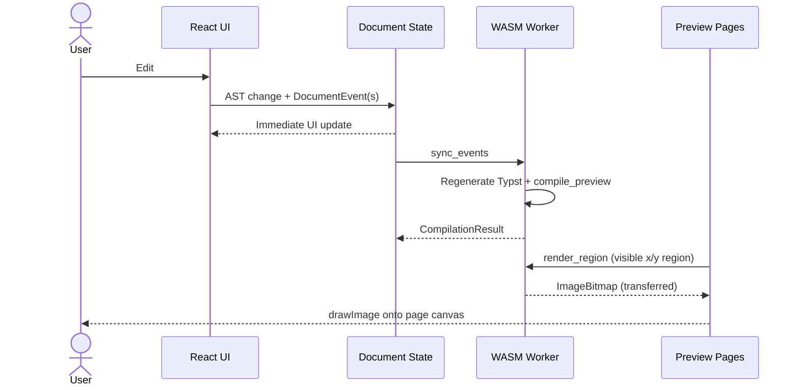
```mermaid
sequenceDiagram
    actor User
    participant UI as React UI
    participant State as Document State
    participant Worker as WASM Worker
    participant Preview as Preview Pages
    User->>UI: Edit
    UI->>State: AST change + DocumentEvent(s)
    State-->>UI: Immediate UI update
    State->>Worker: sync_events
    Worker->>Worker: Regenerate Typst + compile_preview
    Worker-->>State: CompilationResult
    Preview->>Worker: render_region (visible x/y region)
    Worker-->>Preview: ImageBitmap (transferred)
    Preview-->>User: drawImage onto page canvas
```

- Heavy Tauri commands (archive open/save, package and font loading, snapshot mirroring, byte writes) run off the main thread, so the window keeps painting and taking input while they work; the UI shows a loading veil while a project opens or is created, and a "preparing preview" indicator in the preview pane until the session's first page paints. Byte payloads cross IPC as raw bodies (single files or file bundles), never as JSON arrays.
- Bootstrap (open/new project): `CompilerClient.bootstrap` clears the WASM VFS and `DocumentSession`, resets compiled preview state, resets WASM fonts, awaits lazy load of non-bundled project font families (all faces per family), then compiles once. `sync_document_snapshot` on the backend completes before the document sync barrier drains. The UI clears preview pages on `sessionId` change and ignores compile results from a prior session. Edits compile without reloading fonts.
- Queued document events are acknowledged after WASM sync and compile succeed; events already folded into a bootstrap snapshot are acknowledged with the bootstrap and never replayed. The Tauri backend VFS is mirrored on bootstrap (`sync_document_snapshot`) and again before save via the document sync barrier, not on every keystroke. The barrier mirrors whenever the committed AST object differs from the one last mirrored (independent of worker success) and resolves with the mirrored AST; save marks exactly that AST as saved, so edits committed during an in-flight archive write keep the document dirty.
- The WASM preview session materializes only the files Typst compiles (`main.typ`, `lib.typ`, per-element `elements/*.typ`, `references.bib`). The `.ergproj/*.json` sidecars are written only by the backend session, which owns archive I/O. Both source maps are worker-internal (they serve backward and forward preview sync inside the worker); the main thread consumes only `source_revision` and `dirty_resource_ids` from a sync.
- `sync_document_events` applies the full event batch with one `apply_events` call (one source regeneration), matching the WASM worker.
- Main preview and resource previews compile in WASM via `preview_pipeline`.
- Resource preview VFS uses the same `lib.typ` and document-level `#show: apply` as the main document. Each resource in `resources.typ` is wrapped in an explicit `#page(…)[…]` whose `ResourcePreviewPageSize` policy sets axis sizing while keeping pages white with no headers, footers, or numbering. Every resource preview matches project `paper_size` horizontally and hugs content vertically.
- Compiled outline comes from `document.introspector` on the paged document using the same heading filter as the PDF bookmark panel (`bookmarked: true`, or `bookmarked: auto` with `outlined: true`). The sidebar lists every compiled entry; editor headings match by text (including empty → `Untitled heading`), and other entries scroll the preview to that page.
- Incremental `compile_preview` returns page metadata only. Visible main preview pages rasterize only their on-screen rectangular region (page rect intersected with the pane on both axes) via `render_region`, which the worker returns as a transferable `ImageBitmap` drawn onto a region-sized canvas. By default nothing off-screen is rasterized; an advanced overscan setting widens the region. Off-screen pages reserve their box (`content-visibility`) and hold no backing store.
- Main preview pages rasterize only viewport pages whose content changed; unchanged visible pages keep their drawn region. Zoom rescales the existing bitmap immediately (CSS); a reveal (zoom-out/scroll uncovering new area) re-rasterizes after a configurable reveal debounce (`GlobalSettings.preview_reveal_debounce_ms`, default zero), while a covered density change sharpens after a configurable gesture debounce (`GlobalSettings.preview_rasterization_debounce_ms`). While content changes, an optional draft factor rasterizes at reduced density and promotes to full density after an idle window.
- Resource thumbnails rasterize the full (small) page at the displayed width via `render_resource_region` into an `ImageBitmap`, gated on sidebar visibility; the canvas fills the sidebar width (height follows the page aspect) and re-rasterizes after the same debounce when the sidebar is resized.
- Failed compiles report localized toast notifications and keep the last successful preview-visible pages, outline, resources, preview sync maps, and preview revision. Outline and resource catalog state updates only when their content changes (structural comparison), so body typing does not re-render the sidebar.
- Preview does not shift layout with compile-status chrome while typing.
- **Undo/redo:** apply the stored `inverseEvents` / `forwardEvents` locally and queue them for WASM `sync_events`; the resulting AST is mirrored to the backend by the sync barrier before the next save. Destructive inverses carry restore payloads (`RestoreElement`, `RestoreTableRow`, `RestoreTableColumn`). Detaching a figure/diagram asset is an explicit `clear_asset` flag on `UpdateFigure` / `UpdateDiagram` (a null `asset_id` means unchanged), and `SetTemplateVariant` carries a nullable id, so undo can restore "no asset" and "no variant".
- **Body transactions:** the ProseMirror body editor translates each transaction into `DocumentEvent`s by diffing only the window of top-level blocks whose node identity changed between the before/after documents (ProseMirror keeps untouched nodes' identity). Same-count windows diff index-aligned; count-changing windows (Enter split, Backspace merge, multi-block paste) diff by element id with absolute indices and are replay-verified, falling back to a full id-matched section diff. Only when the editor and AST block counts disagree is the whole section re-derived.
- Backend mirror (async): `State->>API: sync_document_events` then `API->>Session: apply_events`. See `collaboration-diagrams.md`.

### Body clipboard paste

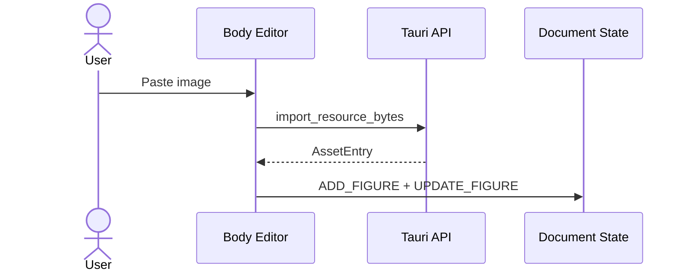
```mermaid
sequenceDiagram
    actor User
    participant PM as Body Editor
    participant API as Tauri API
    participant State as Document State
    User->>PM: Paste image
    PM->>API: import_resource_bytes
    API-->>PM: AssetEntry
    PM->>State: ADD_FIGURE + UPDATE_FIGURE
```

- Handlers live under `src/editor/clipboard/`; each handler exposes `canHandle` and `handle` so future formats register without changing the ProseMirror plugin.
- Image paste follows `TemplateSpec.typst.resources.pasted_image.behavior` (`figure` inserts a figure with `asset_id` set).
- Asset paths use the same `assets/{name}` collision rules as `import_resource_file`.
- Paste is handled in the body editor only; nested table-cell editors keep native text paste until a dedicated handler exists.

## 2. Archive Save And Autosave

New project:

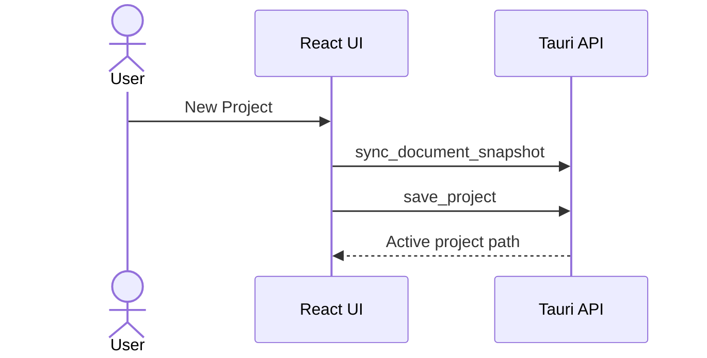
```mermaid
sequenceDiagram
    actor User
    participant UI as React UI
    participant API as Tauri API
    User->>UI: New Project
    UI->>API: sync_document_snapshot
    UI->>API: save_project
    API-->>UI: Active project path
```

Pack archive (manual save and all autosave paths):

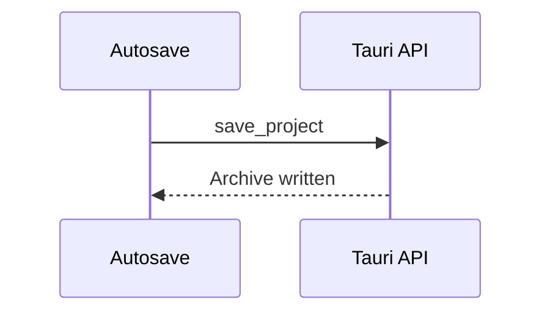
```mermaid
sequenceDiagram
    participant Autosave as Autosave
    participant API as Tauri API
    Autosave->>API: save_project
    API-->>Autosave: Archive written
```

**Autosave triggers** (global `settings.json`): periodic interval, window blur, project close, app close. Each trigger uses the pack sequence when the project is dirty. Canonical archive paths are in `distribution-diagram.md`. Save waits for worker sync and backend mirror drain before packing.

## 3. Archive Open

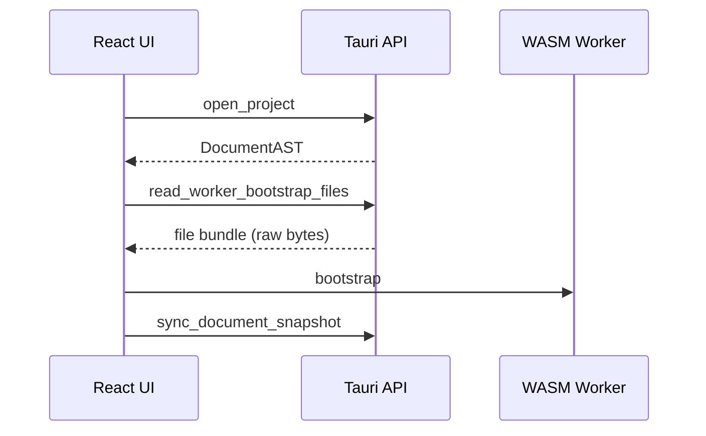
```mermaid
sequenceDiagram
    participant UI as React UI
    participant API as Tauri API
    participant Worker as WASM Worker
    UI->>API: open_project
    API-->>UI: DocumentAST
    UI->>API: read_worker_bootstrap_files
    API-->>UI: file bundle (raw bytes)
    UI->>Worker: bootstrap
    UI->>API: sync_document_snapshot
```

## 4. Insert Reference

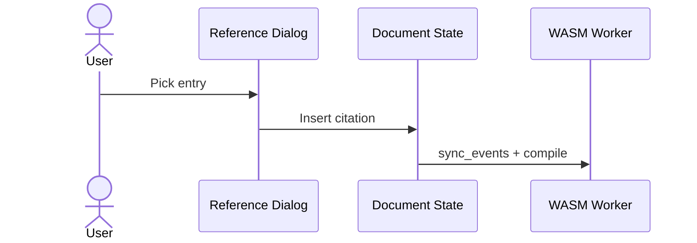
```mermaid
sequenceDiagram
    actor User
    participant Dialog as Reference Dialog
    participant State as Document State
    participant Worker as WASM Worker
    User->>Dialog: Pick entry
    Dialog->>State: Insert citation
    State->>Worker: sync_events + compile
```

## 5. Export

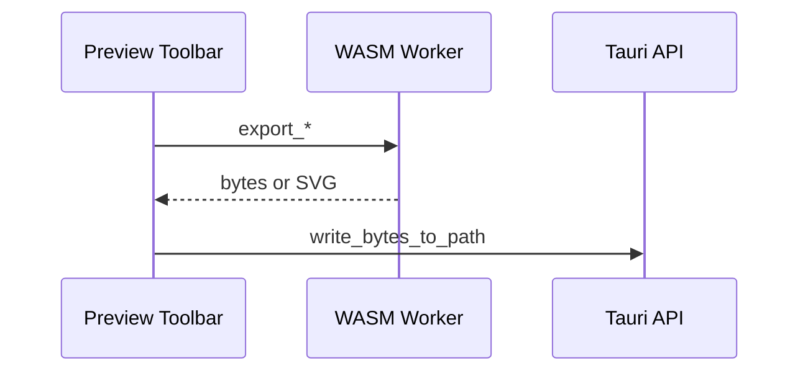
```mermaid
sequenceDiagram
    participant UI as Preview Toolbar
    participant Worker as WASM Worker
    participant API as Tauri API
    UI->>Worker: export_*
    Worker-->>UI: bytes or SVG
    UI->>API: write_bytes_to_path
```

PNG and SVG target the current preview page index.

Bibliography export is backend-canonical: the UI sends reference entries to the Tauri API (`generate_references_bib`, backed by ergo-core's `generate_references_bib`), which applies the same entry normalization as the compiled in-VFS `references.bib`, then writes the file via `write_bytes_to_path`.

## 6. Keymap Resolution

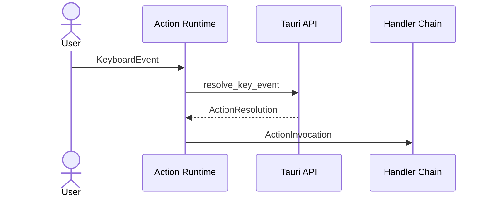
```mermaid
sequenceDiagram
    actor User
    participant Runtime as Action Runtime
    participant API as Tauri API
    participant Handlers as Handler Chain
    User->>Runtime: KeyboardEvent
    Runtime->>API: resolve_key_event
    API-->>Runtime: ActionResolution
    Runtime->>Handlers: ActionInvocation
```

Mouse commands use `dispatchAction` with the same action IDs. Keymap persistence: bundled defaults under app resources; user profiles and overrides in `%APPDATA%/Ergo/keymap.json` (or XDG equivalent). Document undo/redo uses AST history (`edit::Undo`, `edit::Redo`), not ProseMirror history. Resolution is deferred via microtask so synchronous ProseMirror handlers run first.

## 7. Preview And Editor Sync

Backward (preview click → editor):

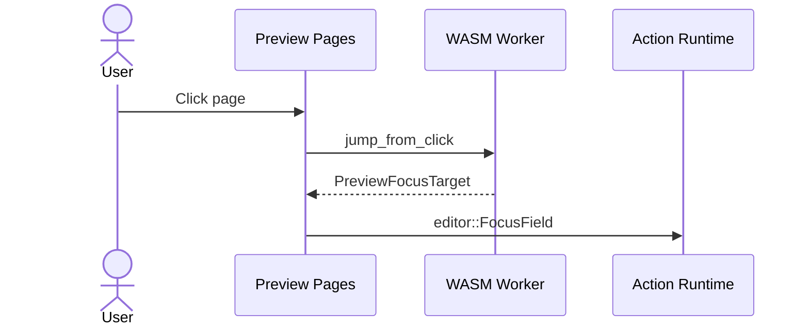
```mermaid
sequenceDiagram
    actor User
    participant Preview as Preview Pages
    participant Worker as WASM Worker
    participant Runtime as Action Runtime
    User->>Preview: Click page
    Preview->>Worker: jump_from_click
    Worker-->>Preview: PreviewFocusTarget
    Preview->>Runtime: editor::FocusField
```

Forward (compile → preview scroll):

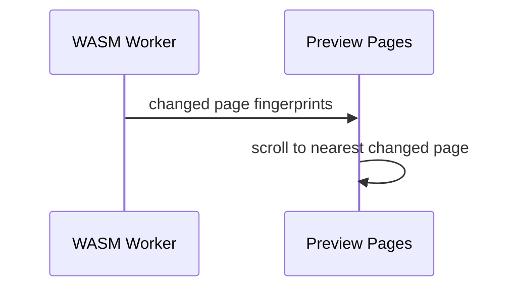
```mermaid
sequenceDiagram
    participant Worker as WASM Worker
    participant Preview as Preview Pages
    Worker->>Preview: changed page fingerprints
    Preview->>Preview: scroll to nearest changed page
```

- Requests use the **displayed** preview revision, not the newest in-flight compile.
- Backward sync prefers `FieldSourceMapEntry`, then element `SourceMapEntry`.
- Forward sync scrolls the preview to the changed page nearest the current viewport anchor after a compile. Manual preview scrolling suppresses auto-scroll until the next compile revision.
- `editor::FocusField` is a stable action shared by preview clicks and sidebar navigation.

## 8. Bibliography Metadata Lookup

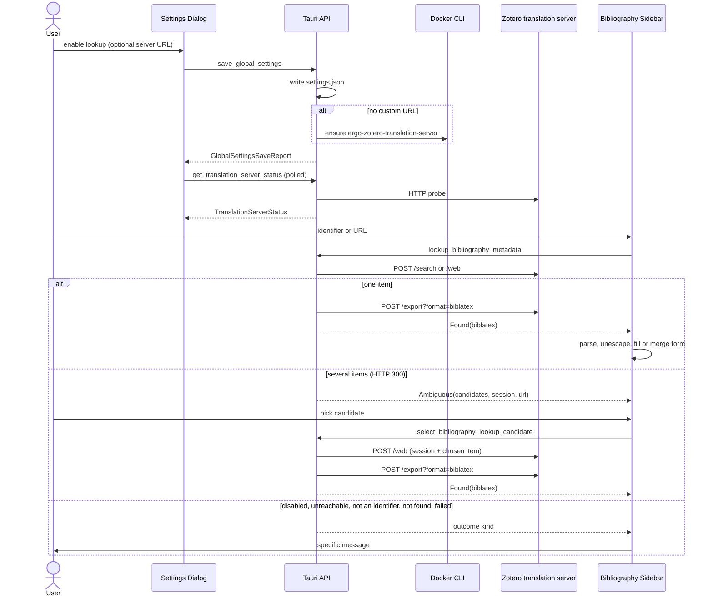
```mermaid
sequenceDiagram
    actor User
    participant Settings as Settings Dialog
    participant API as Tauri API
    participant Docker as Docker CLI
    participant Server as Zotero translation server
    participant Sidebar as Bibliography Sidebar
    User->>Settings: enable lookup (optional server URL)
    Settings->>API: save_global_settings
    API->>API: write settings.json
    alt no custom URL
        API->>Docker: ensure ergo-zotero-translation-server
    end
    API-->>Settings: GlobalSettingsSaveReport
    Settings->>API: get_translation_server_status (polled)
    API->>Server: HTTP probe
    API-->>Settings: TranslationServerStatus
    User->>Sidebar: identifier or URL
    Sidebar->>API: lookup_bibliography_metadata
    API->>Server: POST /search or /web
    alt one item
        API->>Server: POST /export?format=biblatex
        API-->>Sidebar: Found(biblatex)
        Sidebar->>Sidebar: parse, unescape, fill or merge form
    else several items (HTTP 300)
        API-->>Sidebar: Ambiguous(candidates, session, url)
        User->>Sidebar: pick candidate
        Sidebar->>API: select_bibliography_lookup_candidate
        API->>Server: POST /web (session + chosen item)
        API->>Server: POST /export?format=biblatex
        API-->>Sidebar: Found(biblatex)
    else disabled, unreachable, not an identifier, not found, failed
        API-->>Sidebar: outcome kind
        Sidebar->>User: specific message
    end
```

- The effective server is resolved from global settings in one place: `zotero_translation_server_url` when set, otherwise the managed container at `127.0.0.1:1969`. A custom URL means Érgo manages no container.
- Identifiers (DOI, ISBN, PMID, arXiv ID) go to `/search`; `http(s)://` queries go to `/web`. The first item of the translate step is exported as BibLaTeX.
- Lookup, candidate selection, status, and settings save run on the async runtime's blocking pool so Docker and HTTP never block the main thread; app start schedules the container check the same way.
- Settings saves always persist the file; a container failure is reported in `GlobalSettingsSaveReport.translation_server_error` and shown as a toast. Any save while the setting is enabled and the container is not running retries the start.
- In the sidebar, a new entry starts with the identifier step and replaces the empty draft; the same lookup row inside the manual form (create or edit) merges the result over the draft — the lookup's entry type, authors, and provided fields win, other fields and the reference id are kept. LaTeX escapes are decoded and Zotero's `file` field dropped only on this lookup path.
