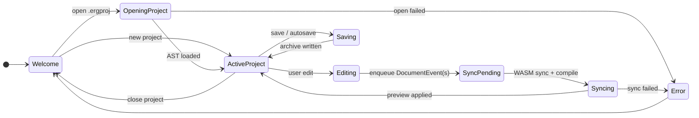
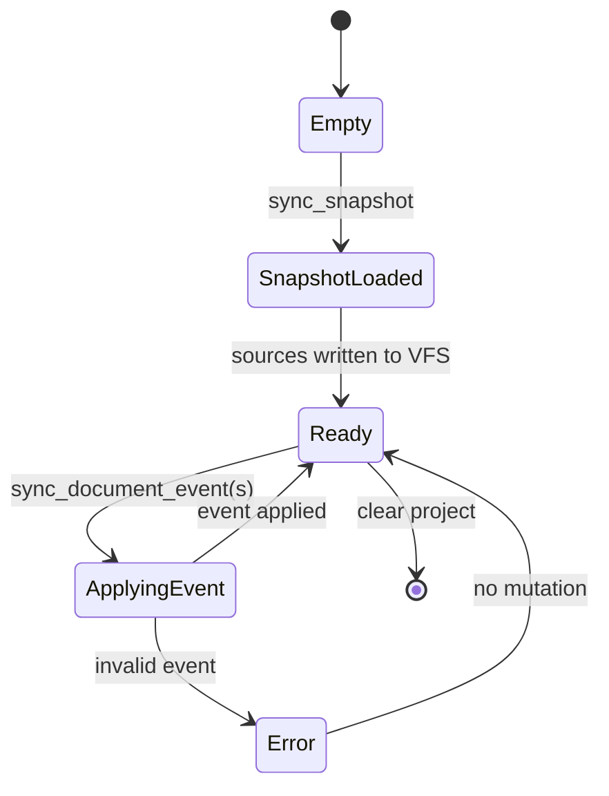
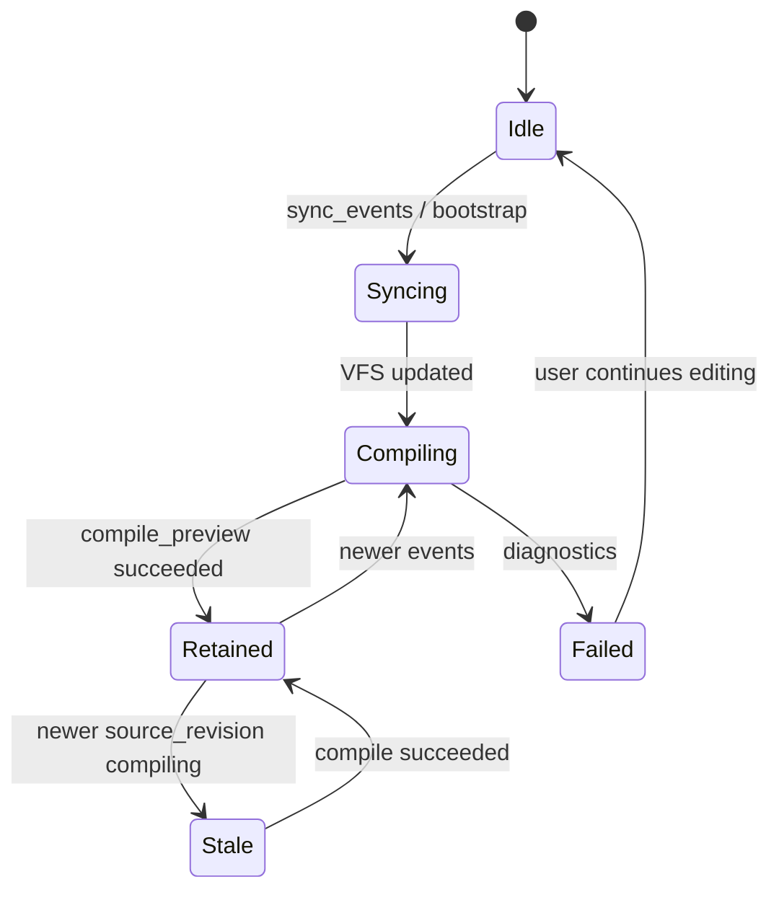
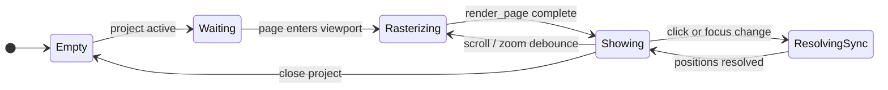
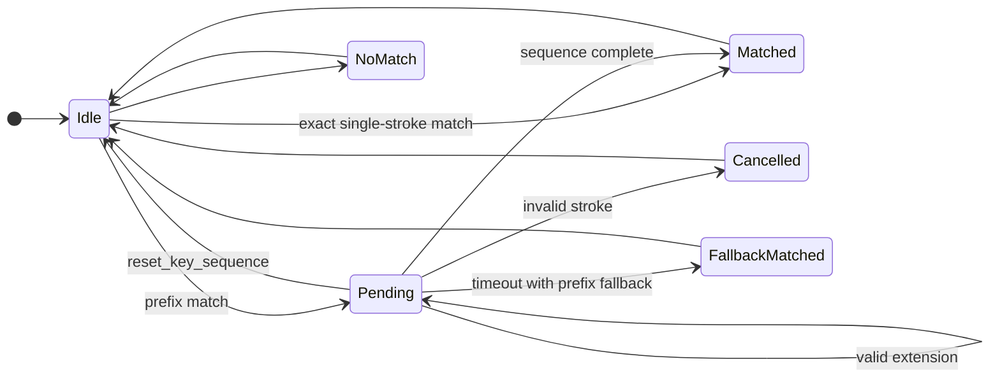

# State Diagrams

Runtime lifecycles for frontend editing, backend document materialization, WASM preview compile, Canvas rendering, and keymap sequences. See `README.md` for the section index.

## 1. Frontend Document Lifecycle

React updates immediately during `Editing`. WASM sync runs asynchronously without blocking further input. Undo and redo replay the history entry's ordered event list through the same sync transition used by normal edits.

## 2. Backend DocumentSession Lifecycle

The backend session mirrors events for archive I/O; it does not compile Typst on the sync path.

## 3. WASM Preview Compile Lifecycle

`PreviewSyncState` updates on successful main compile. Resource document may be cached (comemo) until `dirty_resource_ids` changes.

While **Retained**, `PreviewSyncState` serves `jump_from_click` and `positions_for_focus` for the displayed revision; **Unavailable** when the requested revision does not match the retained preview.

## 4. Canvas Preview Renderer Lifecycle

No visible compile-status UI may resize the preview pane during typing.

## 5. Key Sequence Resolver Lifecycle

Resolver state lives in Rust per window. Logical keys come from `KeyboardEvent.key`.
