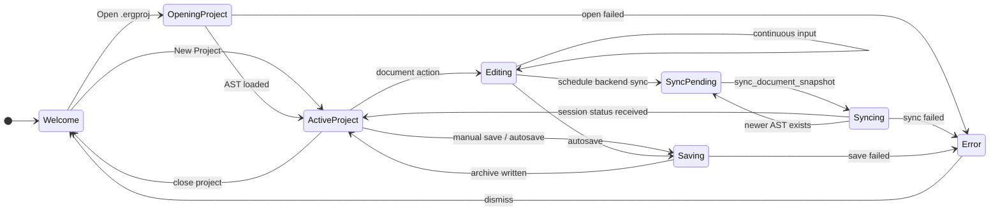
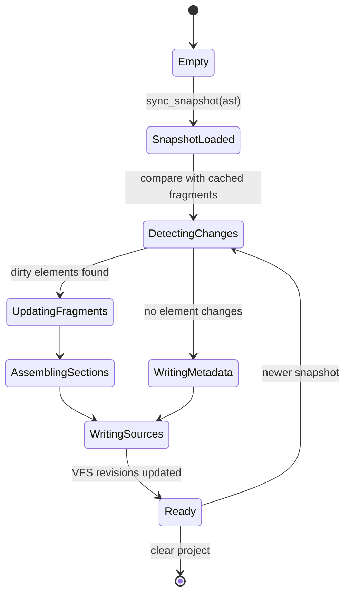
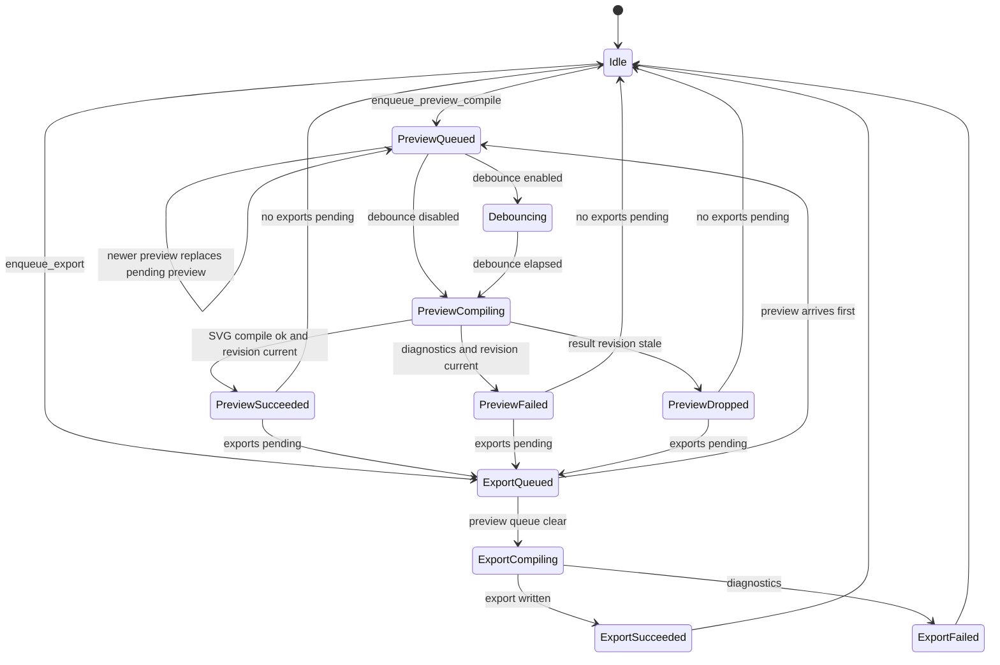
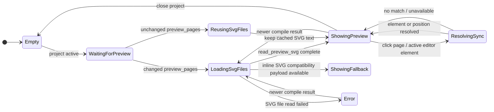
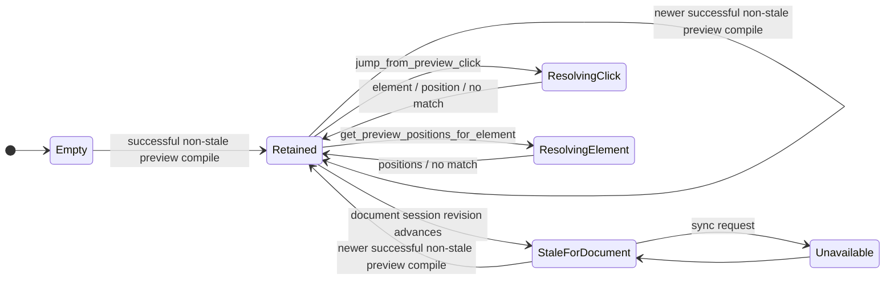
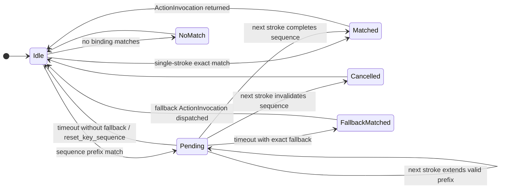

# State Diagrams

This document models the most important runtime lifecycles: frontend document editing, backend document source materialization, and compilation queue execution.

## 1. Frontend Document Lifecycle

### Notes

- React state updates immediately during `Editing`.
- Backend sync is asynchronous and coalesces to the latest AST snapshot.
- The frontend does not wait for compilation before letting users continue editing.

## 2. Backend DocumentSession Lifecycle

### Notes

- `DocumentSession` owns the fragment cache, section assembly, source map, and project source layout.
- `main.typ` changes only when document-wide structure changes, such as section order, references, template metadata, or global source setup.
- `sections/{section-id}.typ` changes when a section's fragments change.
- `.ergproj/source_map.json` is regenerated from backend source ranges.

## 3. Compilation Queue Lifecycle

### Notes

- Preview SVG compilation has priority over exports.
- Preview jobs are deduped to the latest source revision.
- Preview debounce is disabled in default settings. Users can enable it and configure `preview_debounce_ms` in global settings.
- Stale preview results are dropped and must not overwrite newer preview state.
- Exports compile only after preview work is clear.

## 4. Preview Renderer Lifecycle

The preview must not insert or remove visible compile-status UI in a way that causes the page to jump while typing.

## 5. Preview Sync Lifecycle

### Notes

- The retained preview state contains the compiled `PagedDocument`, source-map snapshot, Typst source snapshot, source revision, and page metrics.
- Preview sync accepts requests for the retained preview revision. The current document-session revision may be newer while the displayed preview waits for the next successful compile.
- Backward sync resolves clicks with Typst IDE frame hit testing and maps file offsets to `SourceMapEntry` ranges.
- Forward sync resolves active elements with Typst IDE cursor-to-preview mapping.

## 6. Key Sequence Resolver Lifecycle

### Notes

- The resolver state is owned by Rust per window/session.
- Strokes use logical keys from `KeyboardEvent.key`, normalized for matching while preserving mnemonic shortcuts across layouts and languages.
- Context expressions are evaluated against React's current `ActionContextSnapshot`.
- If an exact binding is also a prefix of a longer binding, Rust returns `PendingSequence` with a fallback action. React dispatches that fallback when the sequence timeout expires.
- Bundled defaults should avoid prefix ambiguity. For example, `Ctrl+O` is only a prefix by default: `Ctrl+O Ctrl+O` opens a project and `Ctrl+O Ctrl+R` opens recent projects. Users may still opt into ambiguous prefix shortcuts through the keymap settings UI or JSON.
