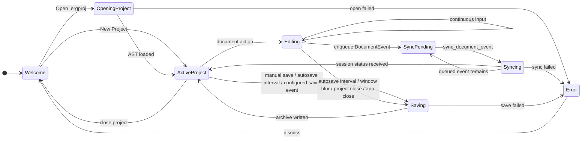
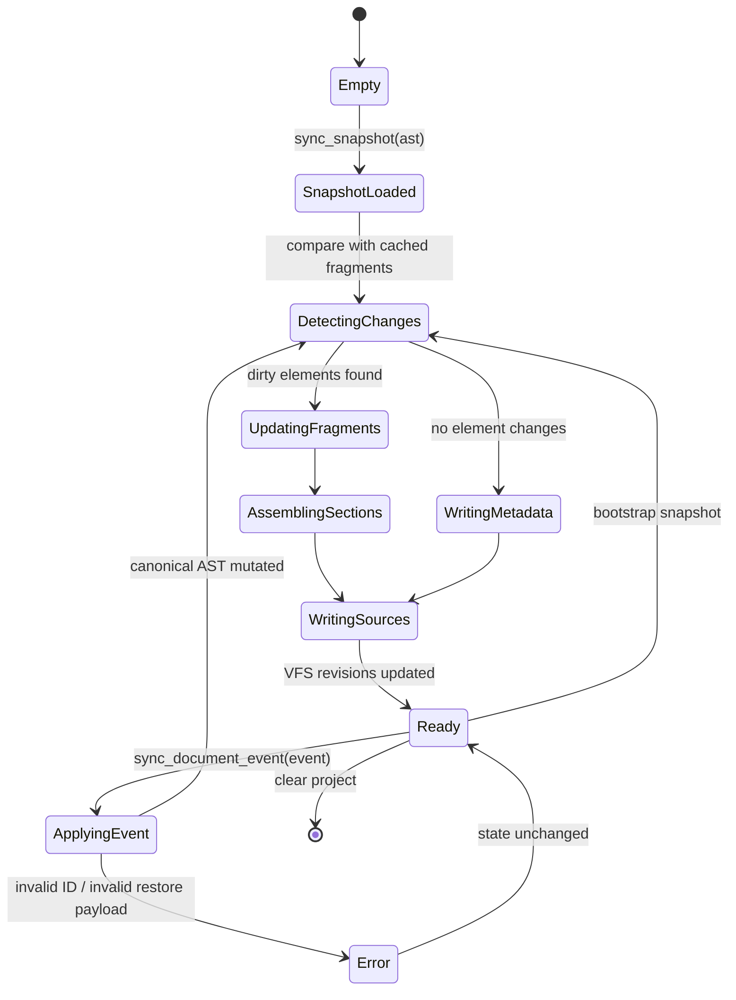
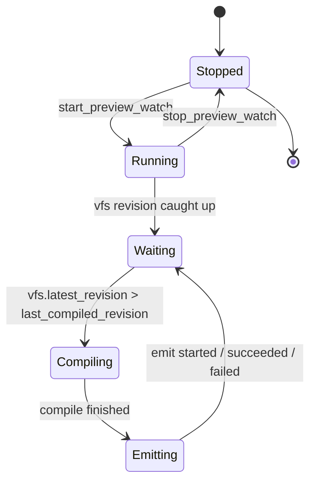
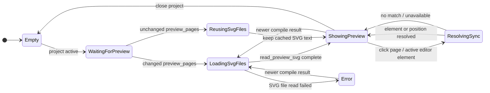
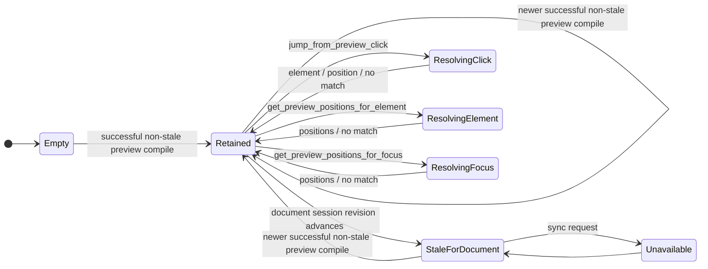
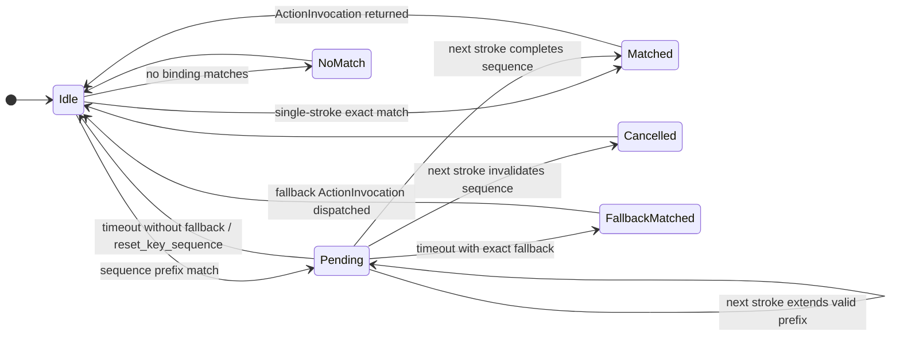

# State Diagrams

This document models the most important runtime lifecycles: frontend document editing, backend document source materialization, and background preview compilation.

## 1. Frontend Document Lifecycle

### Notes

- React state updates immediately during `Editing`.
- Backend sync is asynchronous and serialized. Bootstrap sends an AST snapshot; edits, undo, and redo send queued typed events in order.
- The frontend does not wait for compilation before letting users continue editing.
- Autosave is governed by global settings. Periodic autosave uses the configured interval and save-event toggles cover window blur, app close, and project close.

## 2. Backend DocumentSession Lifecycle

### Notes

- `DocumentSession` owns the fragment cache, section assembly, source map, and project source layout.
- `DocumentSession` owns the canonical backend AST after bootstrap and applies typed document events before generation.
- Invalid events fail without mutating the previous canonical AST.
- `main.typ` changes only when document-wide structure changes, such as section order, references, template metadata, or global source setup.
- `elements/{element-id}.typ` changes when that element's generated fragment changes.
- `.ergproj/source_map.json` is regenerated from backend source ranges.

## 3. TypstWatch Preview Lifecycle

### Notes

- `TypstWatch` owns one background thread with a long-lived `ErgoWorld` and an incremental SVG page cache.
- `sync_document_snapshot`, `sync_document_event`, and `patch_source` call `mark_vfs_changed()` after VFS writes so the watch thread wakes.
- The watch loop compiles the current VFS revision, writes changed `.ergproj/preview/svg/page-N.svg` files, stores the retained preview in `PreviewSyncState`, extracts the outline, and emits `ergo-compile-started`, `ergo-compile-succeeded`, or `ergo-compile-failed`.
- Resource catalog updates are emitted separately through `ergo-resources-updated` from document sync handlers when snapshots or dirty resource IDs require refreshed resource previews.
- `export_document` is a separate synchronous command. It does not pass through `TypstWatch`.

## 4. Preview Renderer Lifecycle

The preview must not insert or remove visible compile-status UI in a way that causes the page to jump while typing.

## 5. Preview Sync Lifecycle

### Notes

- The retained preview state contains the compiled `PagedDocument`, element source-map snapshot, field source-map snapshot, Typst source snapshot, source revision, and page metrics.
- Preview sync accepts requests for the retained preview revision. The current document-session revision may be newer while the displayed preview waits for the next successful compile.
- Backward sync resolves clicks with Typst IDE frame hit testing and maps file offsets to `FieldSourceMapEntry` ranges, falling back to `SourceMapEntry` ranges.
- Forward sync resolves focused fields with Typst IDE cursor-to-preview mapping.

## 6. Key Sequence Resolver Lifecycle

### Notes

- The resolver state is owned by Rust per window/session.
- Strokes use logical keys from `KeyboardEvent.key`, normalized for matching while preserving mnemonic shortcuts across layouts and languages.
- Context expressions are evaluated against React's current `ActionContextSnapshot`.
- If an exact binding is also a prefix of a longer binding, Rust returns `PendingSequence` with a fallback action. React dispatches that fallback when the sequence timeout expires.
- Bundled defaults should avoid prefix ambiguity. For example, `Ctrl+O` is only a prefix by default: `Ctrl+O Ctrl+O` opens a project and `Ctrl+O Ctrl+R` opens recent projects. Users may still opt into ambiguous prefix shortcuts through the keymap settings UI or JSON.
