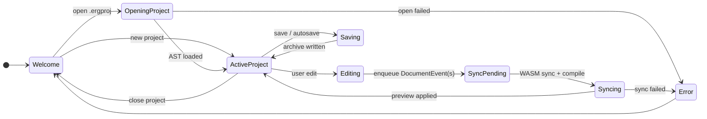
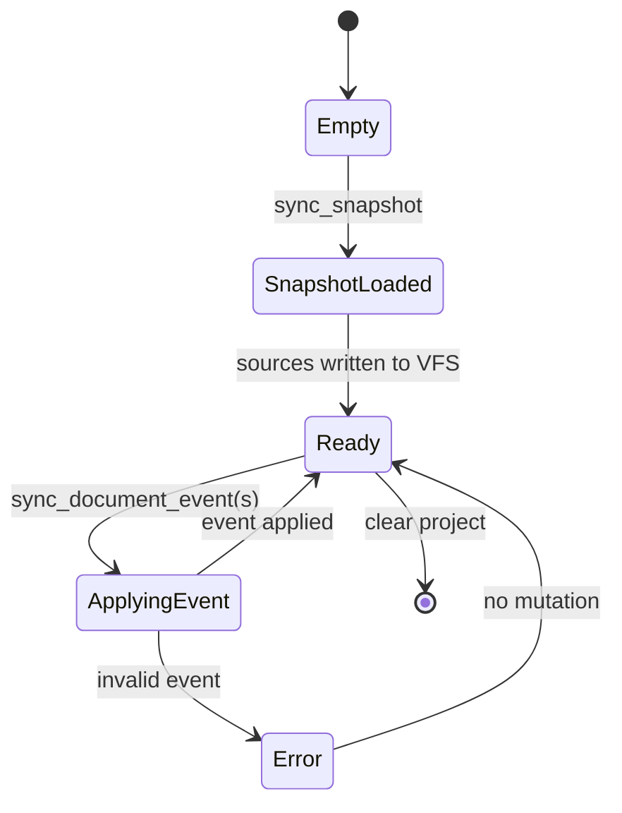
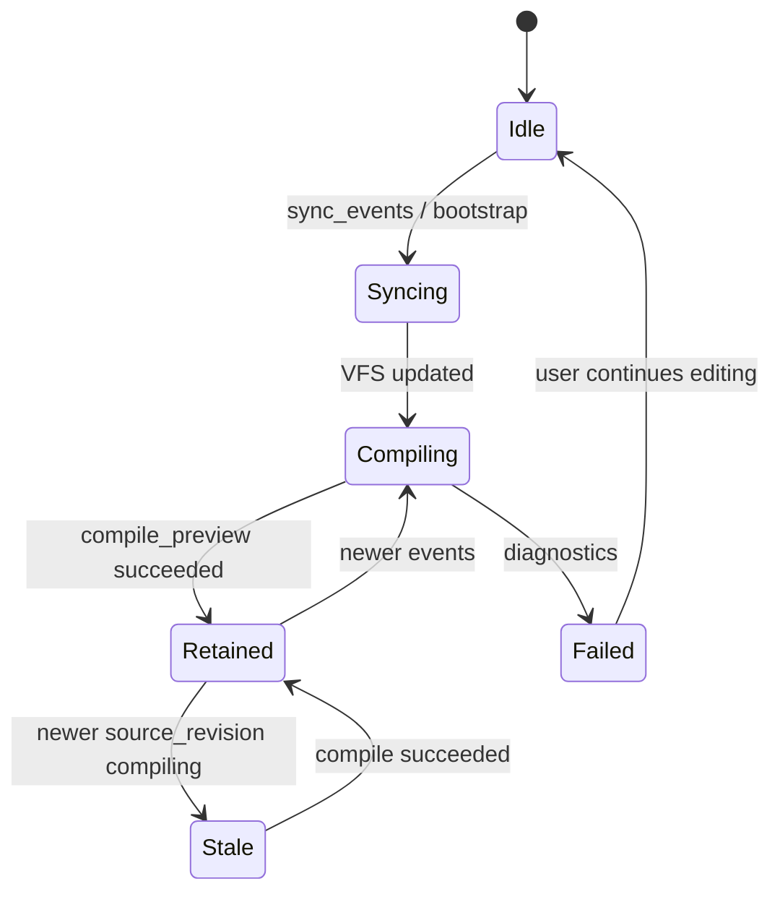
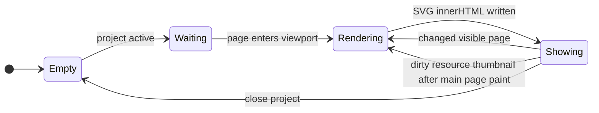
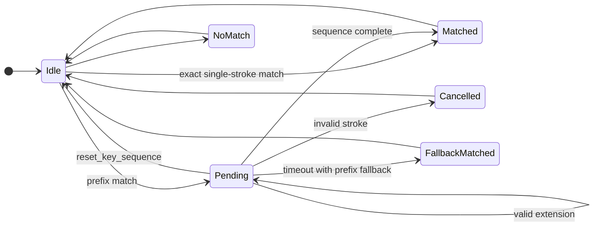

# State Diagrams

Runtime lifecycles for frontend editing, backend document materialization, WASM preview compile, preview page rendering, and keymap sequences. See `README.md` for the section index.

## 1. Frontend Document Lifecycle

React updates immediately during `Editing`. The content body is a controlled ProseMirror view: each local transaction maps to a forward/inverse `DocumentEvent` pair (one undo step), and AST changes from undo, preview focus, or toolbar actions reconcile back into the document without a separate PM history. WASM sync runs asynchronously without blocking further input. Undo and redo replay the history entry's ordered event list through the same sync transition used by normal edits.

## 2. Backend DocumentSession Lifecycle

The backend session mirrors events for archive I/O; it does not compile Typst on the sync path.

## 3. WASM Preview Compile Lifecycle

`PreviewSyncState` updates on successful main compile. Resource document may be cached (comemo) until `dirty_resource_ids` changes.

While **Retained**, `PreviewSyncState` serves `jump_from_click` for the displayed revision; **Unavailable** when the requested revision does not match the retained preview. Forward preview sync scrolls to the changed page nearest the viewport anchor after compile; the UI does not call `positions_for_focus`.

## 4. Preview Page Renderer Lifecycle

No visible compile-status UI may resize the preview pane during typing.
The WASM worker renders main preview pages and resource thumbnails as serialized SVG markup plus compiled Typst page-frame metrics. React writes SVG into stable containers with `innerHTML`; unchanged pages keep their existing SVG content while changed visible pages are replaced in place. The stored metrics drive page layout and click mapping.
Main preview pages have render priority for a revision. Resource thumbnails use resource-specific revisions and write SVG after the main preview has painted that resource revision.

## 5. Key Sequence Resolver Lifecycle

Resolver state lives in Rust per window. Logical keys come from `KeyboardEvent.key`.
