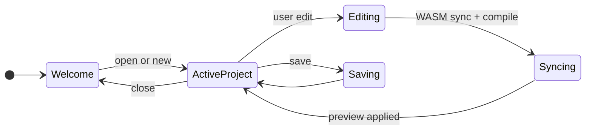
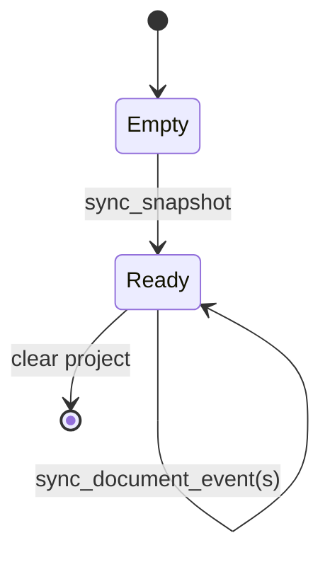
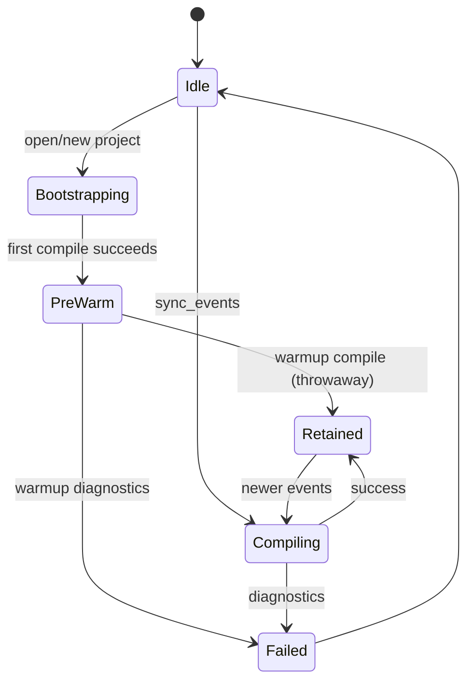
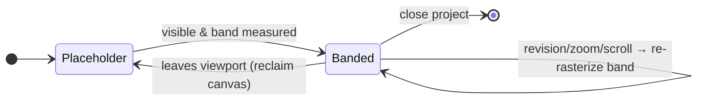
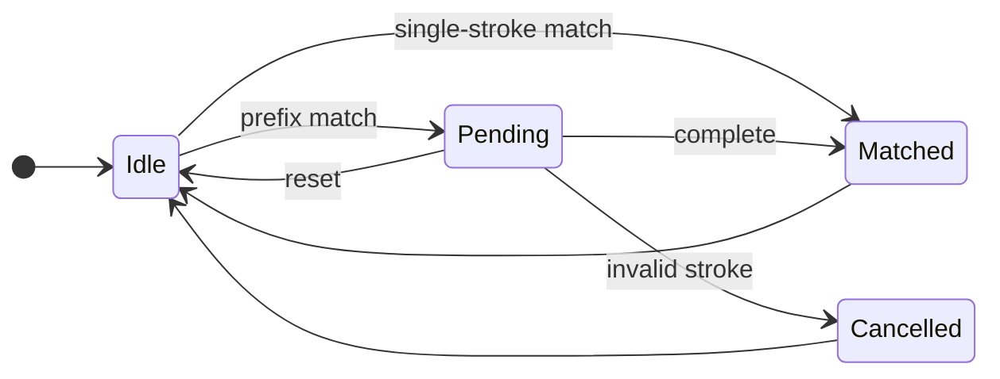

# State Diagrams

Runtime lifecycles for frontend editing, backend document materialization, WASM preview compile, preview page rendering, and keymap sequences. See `README.md` for the section index.

## 1. Frontend Document Lifecycle

```mermaid
stateDiagram-v2
    direction LR
    [*] --> Welcome
    Welcome --> ActiveProject : open or new
    ActiveProject --> Editing : user edit
    Editing --> Syncing : WASM sync + compile
    Syncing --> ActiveProject : preview applied
    ActiveProject --> Saving : save
    Saving --> ActiveProject
    ActiveProject --> Welcome : close
```

React updates immediately during `Editing`. The content body is a controlled ProseMirror view: each local transaction maps to a forward/inverse `DocumentEvent` pair (one undo step), and AST changes from undo, preview focus, or toolbar actions reconcile back into the document without a separate PM history. WASM sync runs asynchronously without blocking further input. Undo and redo replay the history entry's ordered event list through the same sync transition used by normal edits.

## 2. Backend DocumentSession Lifecycle

```mermaid
stateDiagram-v2
    direction TB
    [*] --> Empty
    Empty --> Ready : sync_snapshot
    Ready --> Ready : sync_document_event(s)
    Ready --> [*] : clear project
```

The backend session mirrors events for archive I/O; it does not compile Typst on the sync path. Invalid events leave the session unchanged.

## 3. WASM Preview Compile Lifecycle

```mermaid
stateDiagram-v2
    direction TB
    [*] --> Idle
    Idle --> Bootstrapping : open/new project
    Bootstrapping --> PreWarm : first compile succeeds
    PreWarm --> Retained : warmup compile (throwaway)
    PreWarm --> Failed : warmup diagnostics
    Idle --> Compiling : sync_events
    Compiling --> Retained : success
    Compiling --> Failed : diagnostics
    Failed --> Idle
    Retained --> Compiling : newer events
```

`PreviewSyncState` updates on successful main compile. Resource document may be cached (comemo) until `dirty_resource_ids` changes. The **PreWarm** state runs a throwaway second compile immediately after the bootstrap compile to populate the incremental-compile cache (comemo entries, font shaping, layout) so the user's first keystroke does not pay JIT and cache-miss costs. While **Retained**, `PreviewSyncState` serves `jump_from_click` for the displayed revision. Forward preview sync scrolls to the changed page nearest the viewport anchor after compile.

## 4. Preview Page Renderer Lifecycle

```mermaid
stateDiagram-v2
    direction LR
    [*] --> Placeholder
    Placeholder --> Banded : visible & band measured
    Banded --> Banded : revision/zoom/scroll → re-rasterize band
    Banded --> Placeholder : leaves viewport (reclaim canvas)
    Banded --> [*] : close project
```

No visible compile-status UI may resize the preview pane during typing. Each preview page and resource thumbnail is a `<canvas>` showing a white placeholder until its content is drawn. The WASM worker rasterizes the visible rectangular region (`render_region`, with `x` and `y` bounds) at the page's pixel density into straight-alpha RGBA, decodes it into a transferable `ImageBitmap`, and the page composites it with `drawImage`; compiled Typst page-frame metrics accompany each render. By default only on-screen content is rasterized (an advanced overscan setting widens the region). Leaving the viewport drops the canvas backing store so off-screen pages cost no raster memory; zoom and scroll re-rasterize the revealed region (promptly when uncovering new area, after a debounce when only sharpening).

## 5. Key Sequence Resolver Lifecycle

```mermaid
stateDiagram-v2
    direction LR
    [*] --> Idle
    Idle --> Matched : single-stroke match
    Idle --> Pending : prefix match
    Pending --> Matched : complete
    Pending --> Cancelled : invalid stroke
    Pending --> Idle : reset
    Matched --> Idle
    Cancelled --> Idle
```

Resolver state lives in Rust per window. Logical keys come from `KeyboardEvent.key`. User overrides are stored per named profile in `keymap.json` (`active_profile_id`, `profiles[]`); bundled defaults remain immutable for every profile. Prefix fallback and timeout behavior are documented in the Rust resolver implementation.
