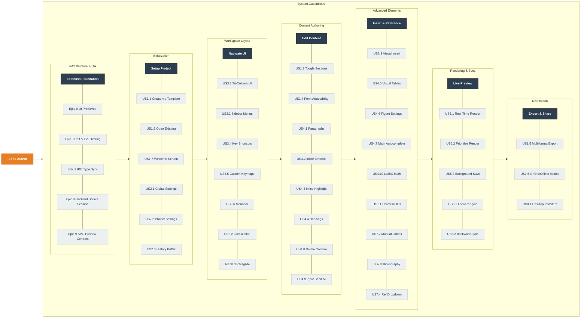

# Actor Definition and User Story Map

As Érgo utilizes an Agile desktop application architecture (without traditional multi-tenant cloud roles), this document replaces the traditional strict "Use Case Diagram" and "Role Definition." Instead, it uses a **User Story Map** to visually outline the system's capabilities and the user's journey through the application, satisfying the requirement for high-level capability modeling.

## Actor Definition

In the context of the Érgo IDE (v1.0), there is only one primary actor interacting with the system boundaries.

* **Actor Name:** The Author / Academic
* **Description:** A local user interacting directly with the Érgo desktop application. They are responsible for creating, configuring, authoring, and exporting documents. The system relies entirely on this actor's inputs, as there are no background administrative roles, secondary editors, or external system actors in this self-contained workflow.

## User Story Map (High-Level Capability Diagram)

The following diagram maps the Agile **User Stories** across the chronological **User Journey** (horizontal axis), grouped by specific functional phases (vertical axis). This provides a complete "bird's-eye view" of what the Actor can do within the system.

**Diagram Notes:**
* "The Author" acts as the Primary Actor within the local boundaries of the application.
* "J1" through "J6" represent the high-level steps (the Journey) the user takes.
* The story codes (e.g., US1.1) correspond directly to the formal requirements listed in the User Stories specification.

