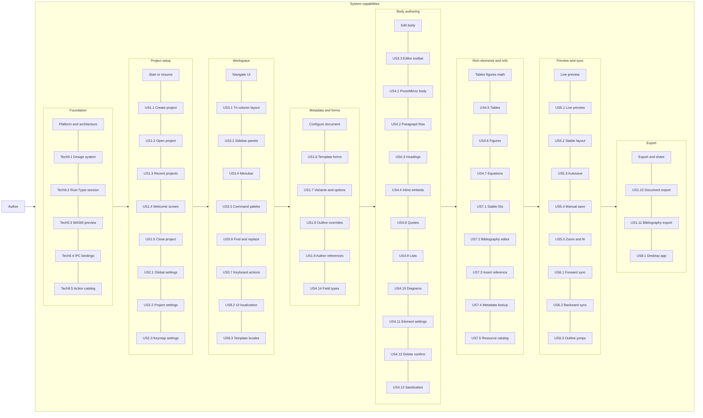

# Actor definition and user story map

Érgo is a single-user local desktop application. This document defines the primary actor and maps product capabilities across the author’s journey. Story codes (e.g. US1.1) match `user-stories.md` and `requirements.md`.

## Actor definition

* **Actor name:** The author / academic
* **Description:** A local user of the Érgo desktop app who creates projects, edits structured metadata and body content, manages bibliography and resources, previews compiled output, and exports finished documents. There are no multi-tenant roles, shared editing, or external workflow actors in v1.

## User story map

The horizontal axis is the chronological journey; the vertical groupings are functional phases. Technical epics (Epic 9) underpin all phases but sit outside the journey spine.

